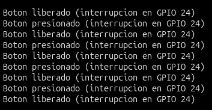

# IMU BMI270 con visualización en display OLED (SPI)

## Objetivo

Se presenta una aplicación avanzada que combina dos protocolos de
comunicación distintos operando de forma simultánea sobre el mismo
microcontrolador: una unidad de medición inercial (IMU) BMI270 de seis ejes
(acelerómetro y giroscopio) conectada por **SPI**, y un display OLED SSD1306
de 128×64 píxeles conectado por **I²C**. El RP2040 realiza la lectura
periódica del sensor y presenta los resultados en tiempo real sobre el
display, sin depender del monitor serie.

A diferencia del ejemplo equivalente por I²C (sección Aplicaciones e
Integración, `i2c_oled.md`), en el que ambos dispositivos comparten un único
bus I²C, aquí se introduce el uso de **dos periféricos hardware
independientes en paralelo**: el bloque SPI0 para el BMI270 y el bloque I2C0
para el OLED. Esto permite, entre otras cosas, alcanzar frecuencias de
comunicación mucho más altas hacia el sensor que las disponibles en I²C
estándar.

## Descripción general

| Dispositivo | Función | Protocolo | Dirección/Selección |
|---|---|---|---|
| BMI270 | IMU de 6 ejes (acelerómetro + giroscopio) | SPI | Chip Select por GPIO dedicado |
| SSD1306 | Display OLED 128×64 | I²C | `0x3C` (usual) o `0x3D` (alterna) |

Ambos dispositivos utilizan periféricos de hardware completamente separados
dentro del RP2040: no existe conflicto eléctrico ni de direccionamiento entre
ellos, ya que cada uno corre sobre su propio conjunto de líneas físicas.

## Hardware requerido

- Placa RP2040 (modelo AR3203, USB-C)
- Módulo IMU BMI270 (con interfaz SPI expuesta: SCL/SCLK, SDA/MOSI, SDO/MISO, CS)
- Display OLED SSD1306 128×64 (I²C)
- Cables de conexión / protoboard

## Conexiones

| Señal | Dispositivo | GPIO RP2040 |
|---|---|---|
| SCLK | BMI270 (SCL) | GP2 |
| MOSI | BMI270 (SDA) | GP3 |
| MISO | BMI270 (SDO) | GP4 |
| CS | BMI270 (CS) | GP5 |
| SDA | SSD1306 | GP0 |
| SCL | SSD1306 | GP1 |
| VCC | Ambos | 3V3 |
| GND | Ambos | GND |

El BMI270 se conecta al bus SPI0; el SSD1306 se conecta, de forma
independiente, al bus I2C0.

## Selección del periférico: por qué `SPI` y `Wire` por separado

El RP2040 cuenta con **dos bloques de hardware SPI** (SPI0 y SPI1) y **dos
bloques de hardware I²C** (I2C0 e I2C1), cada uno accesible mediante GPIOs
específicos y todos operando de forma completamente independiente entre sí.

::: info
(Para referencia visual. Consultar la tabla completa de mapeo GPIO↔periférico
en [hardware.md](../guide/hardware.md#pinout-completo).)
:::

En el core RP2040 para Arduino, el objeto `SPI` está enlazado en tiempo de
compilación al bloque SPI0, mientras que el objeto `Wire` está enlazado al
bloque I2C0. Los métodos `setSCK()`, `setTX()`, `setRX()` (para SPI) y
`setSDA()`/`setSCL()` (para I²C) **no reasignan el periférico**: únicamente
indican qué pines usará el bloque ya fijo de ese objeto, y validan que el pin
pertenezca al bloque correspondiente.

El pin de **Chip Select (CS)** del BMI270 no se remapea mediante la clase
`SPI`: la biblioteca de SparkFun lo controla directamente por GPIO
(`pinMode`/`digitalWrite`) al recibir el número de pin como argumento de
`beginSPI()`. Esto es una diferencia relevante frente a otros periféricos
SPI, donde el CS sí forma parte de la configuración de la clase `SPI`.

Dado que este ejemplo usa GP2/GP3/GP4 para SPI0 y GP0/GP1 para I2C0, el
código inicializa ambos periféricos de forma independiente en `setup()`,
cada uno con su propia llamada a `begin()`.

## Bibliotecas requeridas (Instalación)

Instalables desde el Gestor de Bibliotecas del Arduino IDE:

- **Adafruit SSD1306** (requiere como dependencia **Adafruit GFX Library**)
- **SparkFun BMI270 Arduino Library**

## Estructura del proyecto

```
bmi270_spioled/
└── bmi270_spioled.ino
```

## Código completo

```cpp
#include <SPI.h>
#include <Wire.h>
#include "SparkFun_BMI270_Arduino_Library.h"
#include <Adafruit_SSD1306.h>

#define SCREEN_WIDTH 128
#define SCREEN_HEIGHT 64
#define OLED_RESET -1

// Bus I2C (OLED) - bloque I2C0
#define SDA_PIN 0
#define SCL_PIN 1

// Bus SPI (BMI270) - bloque SPI0
#define PIN_SCLK  2  // scl
#define PIN_MISO  4  // sdo
#define PIN_MOSI  3  // sda
#define PIN_CS    5  // cs

BMI270 imu;
Adafruit_SSD1306 display(SCREEN_WIDTH, SCREEN_HEIGHT, &Wire, OLED_RESET);

// Parametro de reloj SPI. Se deja en 100 kHz por margen de estabilidad en
// esta practica; una vez verificado el enlace, puede incrementarse (el
// BMI270 admite hasta 10 MHz en modo SPI) para reducir el tiempo de
// transaccion por lectura.
uint32_t clockFrequency = 100000;

void setup()
{
    Serial.begin(115200);
    Serial.println("BMI270 Example SPI - Basic Readings SPI with OLED print");

    // Bus I2C para el OLED
    Wire.setSDA(SDA_PIN);
    Wire.setSCL(SCL_PIN);
    Wire.begin();
    Wire.setClock(400000);

    // En el nucleo Arduino-Pico, el mapeo de pines del periferico SPI0 se
    // define ANTES de SPI.begin(). No es necesario remapear CS: la libreria
    // de SparkFun lo maneja directo por GPIO (pinMode/digitalWrite), sin
    // pasar por la clase SPI.
    SPI.setSCK(PIN_SCLK);
    SPI.setTX(PIN_MOSI);
    SPI.setRX(PIN_MISO);
    SPI.begin();

    // Check if sensor is connected and initialize
    // Clock frequency is optional (defaults to 100kHz)
    while (imu.beginSPI(PIN_CS, clockFrequency) != BMI2_OK)
    {
        Serial.println("Error: BMI270 not connected, check wiring and CS pin!");
        delay(1000);
    }

    Serial.println("BMI270 connected!");

    if (!display.begin(SSD1306_SWITCHCAPVCC, 0x3C)) {
        Serial.println("Error con 0x3C, probando 0x3D...");
        if (!display.begin(SSD1306_SWITCHCAPVCC, 0x3D)) {
            Serial.println("Error OLED en ambas direcciones");
            return;
        }
    }

    Serial.println("OLED inicializada!");
    display.clearDisplay();
    display.setTextSize(1);
    display.setTextColor(SSD1306_WHITE);
    display.setCursor(0, 0);
    display.println("BMI270 Test");
    display.display();
}

void loop()
{
    imu.getSensorData();

    // Serial (debug completo)
    Serial.print("Acceleration in g's\t");
    Serial.print("X: "); Serial.print(imu.data.accelX, 3); Serial.print("\t");
    Serial.print("Y: "); Serial.print(imu.data.accelY, 3); Serial.print("\t");
    Serial.print("Z: "); Serial.println(imu.data.accelZ, 3);

    Serial.print("Rotation in deg/sec\t");
    Serial.print("X: "); Serial.print(imu.data.gyroX, 3); Serial.print("\t");
    Serial.print("Y: "); Serial.print(imu.data.gyroY, 3); Serial.print("\t");
    Serial.print("Z: "); Serial.println(imu.data.gyroZ, 3);

    // OLED
    display.clearDisplay();

    // Titulo grande arriba
    display.setTextSize(2);
    display.setCursor(28, 0);
    display.println("BMI270");

    // Linea separadora bajo el titulo
    display.drawFastHLine(0, 18, SCREEN_WIDTH, SSD1306_WHITE);

    // Volver a tamano normal para los datos
    display.setTextSize(1);

    // Encabezados de columna
    display.setCursor(0, 22);
    display.print("Accel");
    display.setCursor(70, 22);
    display.print("Gyro");

    // Columna izquierda: aceleracion
    display.setCursor(0, 32);
    display.print("X:"); display.println(imu.data.accelX, 2);
    display.setCursor(0, 42);
    display.print("Y:"); display.println(imu.data.accelY, 2);
    display.setCursor(0, 52);
    display.print("Z:"); display.println(imu.data.accelZ, 2);

    // Columna derecha: giroscopio
    display.setCursor(70, 32);
    display.print("X:"); display.println(imu.data.gyroX, 2);
    display.setCursor(70, 42);
    display.print("Y:"); display.println(imu.data.gyroY, 2);
    display.setCursor(70, 52);
    display.print("Z:"); display.println(imu.data.gyroZ, 2);

    display.display();

    delay(20);
}
```

## Explicación del funcionamiento

### Inicialización (`setup()`)

1. Se configura el puerto serie a 115200 baudios, usado únicamente para
   depuración.
2. Se asignan los pines GP0/GP1 al objeto `Wire` y se inicializa el bus I²C
   a 400 kHz (modo I²C Fast Mode), exclusivamente para el OLED.
3. Se asignan los pines GP2/GP3/GP4 al objeto `SPI` (reloj, salida y entrada
   de datos, respectivamente) **antes** de llamar a `SPI.begin()`, siguiendo
   el orden requerido por el núcleo Arduino-Pico.
4. Se llama a `imu.beginSPI(PIN_CS, clockFrequency)`, pasando el pin de Chip
   Select y la frecuencia de reloj como argumentos. El pin `CS` no requiere
   mapeo previo mediante la clase `SPI`, ya que la biblioteca de SparkFun lo
   controla directamente por GPIO. Si la inicialización falla, el ciclo
   `while` reintenta indefinidamente cada segundo, a diferencia del ejemplo
   por I²C.
5. Se inicializa el display, con patrón de dirección alterna (`0x3C` /
   `0x3D`), igual que en el ejemplo por I²C.
6. Se escribe un mensaje inicial de verificación ("BMI270 Test") y se llama
   a `display.display()` para confirmar que el display responde antes de
   entrar al ciclo principal.

### Ciclo principal (`loop()`)

En cada iteración:

1. `imu.getSensorData()` actualiza la estructura `imu.data` con las lecturas
   más recientes de acelerómetro (`accelX/Y/Z`, en g) y giroscopio
   (`gyroX/Y/Z`, en grados/segundo). Esta llamada dispara internamente una
   o varias transacciones SPI hacia el sensor.
2. Los seis valores se imprimen por el puerto serie para depuración.
3. El buffer del display se limpia (`clearDisplay()`) y se reconstruye por
   completo en cada ciclo: título, línea separadora, encabezados de columna
   y los seis valores organizados en dos columnas (aceleración a la
   izquierda, giroscopio a la derecha).
4. `display.display()` transmite el buffer completo al controlador SSD1306
   por I²C. Este paso es indispensable: toda la API de Adafruit_GFX
   (`print`, `println`, `drawFastHLine`, etc.) solo escribe sobre un buffer
   en RAM, no sobre la pantalla física.
5. `delay(20)` limita la tasa de refresco a aproximadamente 50 Hz.

## Compilación y carga

1. En el Arduino IDE, seleccionar la placa RP2040 correspondiente y el
   puerto correcto en el menú **Herramientas**.
2. Si es la primera carga sobre la placa (o el bootloader UF2 no tiene aún
   firmware Arduino), debe entrarse en modo **BOOTSEL**: desconectar el USB,
   mantener presionado el botón BOOTSEL, conectar el USB, presionar el botón
   RST manteniendo el botón BOOTSEL presionado y soltar el botón un par de
   segundos después. La placa aparece como unidad de almacenamiento masivo
   y, en el IDE, como un puerto especial de tipo UF2.
3. En cargas posteriores, el propio botón "Subir" reinicia la placa a modo
   bootloader automáticamente; no debería ser necesario repetir el paso 2.
4. En Linux, si el puerto no aparece o se reporta error de permisos,
   verificar que el usuario pertenezca al grupo `dialout`:
   ```bash
   sudo usermod -aG dialout $USER
   ```
   y reiniciar sesión para que el cambio surta efecto.

## Verificación

Al finalizar la carga, el display debe mostrar el encabezado "BMI270", una
línea separadora, y dos columnas ("Accel" / "Gyro") con los valores de X, Y y
Z actualizándose en tiempo real conforme se mueve la placa. El monitor serie
(115200 baudios) muestra en paralelo las mismas seis lecturas con mayor
precisión (3 decimales frente a los 2 mostrados en el OLED, por restricción
de espacio horizontal).

<div align="center"></div>

## Variantes y extensiones posibles

- Incrementar `clockFrequency` por encima de 100 kHz (el BMI270 admite hasta
  10 MHz en modo SPI) y comparar la estabilidad de las lecturas frente a la
  tasa de refresco del OLED.
- Incorporar la lectura de temperatura interna del BMI270
  (`imu.data.temperature`, si la biblioteca la expone) como tercer bloque de
  datos.
- Sustituir el `delay(20)` por temporización basada en `millis()` para
  permitir tareas adicionales sin bloquear el ciclo.
- Aplicar un filtro complementario simple entre acelerómetro y giroscopio
  como introducción a la estimación de orientación (ángulos de cabeceo y
  alabeo).
- Publicar las lecturas por Wi-Fi (enlace natural con el Módulo III del
  seminario, que cubre conectividad IoT).

## Errores comunes

| Síntoma | Causa | Solución |
|---|---|---|
| `no matching function for call to 'TwoWire::begin(int, int, int)'` | La sobrecarga de 3 argumentos de `Wire.begin(sda, scl, freq)` pertenece al core de ESP32, no al de RP2040. | Usar `setSDA()` / `setSCL()` / `begin()` / `setClock()` por separado. |
| `imu.beginSPI()` nunca retorna `BMI2_OK` | Pines de SPI mapeados después de `SPI.begin()`, o CS conectado a un pin distinto al pasado como argumento. | Confirmar que `setSCK()`/`setTX()`/`setRX()` se llamen antes de `SPI.begin()`, y que `PIN_CS` coincida con la conexión física. |
| El OLED no responde aunque el BMI270 sí | Bus I²C (`Wire`) inicializado en pines que no corresponden al bloque I2C0, o dirección incorrecta. | Confirmar con la tabla de mapeo GPIO↔bloque I²C, y verificar ambas direcciones (`0x3C`/`0x3D`). |
| La pantalla se queda congelada mostrando el primer mensaje | Falta la llamada a `display.display()` dentro de `loop()`. Toda la API gráfica solo modifica un buffer en RAM. | Llamar a `display.display()` al final de cada ciclo. |
| Los datos nuevos se superponen a los anteriores en el OLED | Falta `display.clearDisplay()` antes de redibujar el buffer. | Limpiar el buffer al inicio de cada actualización. |
| El IDE no detecta la placa o no sube el sketch | La placa no está en modo bootloader (primera carga), o el usuario no tiene permisos sobre el puerto serie en Linux. | Entrar en modo BOOTSEL manualmente; en Linux, agregar el usuario al grupo `dialout`. |

A diferencia del ejemplo por I²C, aquí la inicialización del BMI270 sí
reintenta correctamente ante fallas transitorias: el ciclo
`while (imu.beginSPI(...) != BMI2_OK) { ... delay(1000); }` repite la propia
llamada de inicialización en cada iteración, no solo el mensaje de error.
