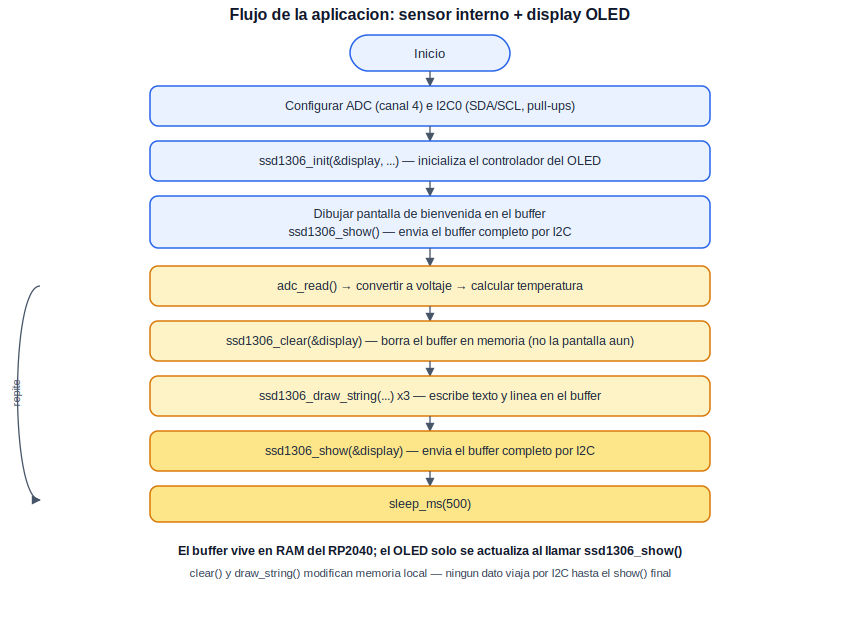

# Aplicación: Sensor de temperatura interno con visualización en OLED

Esta aplicación combina dos periféricos ya cubiertos por separado en Periféricos Básicos —el ADC (práctica 5) y el bus I2C (práctica 9)— para construir un instrumento autónomo simple: la temperatura interna del RP2040 se lee de manera continua y se muestra en un display OLED SSD1306, sin depender de una terminal serial para observar el resultado. Este patrón —sensor más pantalla local— es la base de la gran mayoría de instrumentos de medición independientes.

## Concepto Teórico

La lectura del sensor de temperatura interno mediante el canal 4 del ADC, y la configuración del bus I2C (SDA, SCL, resistencias de pull-up), ya se cubrieron en detalle en sus respectivas prácticas de Periféricos Básicos y no se repiten aquí. Lo nuevo en esta aplicación es cómo se controla un display gráfico a través de ese mismo bus I2C.

Un display OLED monocromo como el SSD1306 no se actualiza píxel por píxel en tiempo real: el patrón habitual —y el que emplea la biblioteca utilizada en esta práctica— consiste en mantener una copia completa de la imagen en un área de memoria RAM del propio RP2040 (el *framebuffer* o *buffer*), y transmitir ese buffer completo al controlador del display solo cuando la imagen está lista. Para un panel de 128×64 píxeles organizado en páginas de 8 píxeles verticales cada una (64 ÷ 8 = 8 páginas), el buffer ocupa 128 × 8 = 1024 bytes. Todas las funciones de dibujo (borrar, escribir texto, trazar una línea) únicamente modifican esta copia en memoria; nada se transmite por el bus hasta que se invoca explícitamente la función que envía el buffer completo. Esto permite componer una imagen mediante varias operaciones de dibujo sin generar tráfico I2C innecesario, y evita que la pantalla se vea parpadear mientras se construye.

El propio controlador SSD1306 requiere, además, una secuencia de inicialización específica del fabricante (activación de su bomba de carga interna —necesaria porque el panel opera a una tensión mayor que los 3.3 V lógicos—, configuración de contraste, modo de direccionamiento, y orientación de barrido). Esta secuencia es una particularidad del propio chip controlador, no del protocolo I2C en general, razón por la cual esta aplicación recurre a una biblioteca de terceros ya probada en lugar de reimplementarla desde cero (véase la sección de Dependencias).

El siguiente diagrama resume el flujo completo de la aplicación, desde la configuración inicial hasta el ciclo de actualización continua:

<div align="center">
  
</div>

**Cálculo del costo de cada actualización de pantalla.** Cada llamada que envía el buffer completo transmite 1024 bytes de imagen más 1 byte de control, en una sola transacción I2C de 1025 bytes. A 400 kHz (2.5 µs por bit), y considerando 9 bits por byte (8 de dato + 1 de ACK) más la fase inicial de dirección (9 bits):

```
bits_totales = 9 + 1025 × 9 = 9234 bits
tiempo ≈ 9234 × 2.5 µs ≈ 23.1 ms
```

Frente a la pausa de 500 ms entre actualizaciones que emplea esta aplicación, los 23.1 ms que toma actualizar la pantalla representan poco más del 4 % del ciclo — no supone un cuello de botella perceptible, aunque sí sería relevante si se intentara refrescar el display a una tasa mucho más alta (por ejemplo, para animaciones).

## Hardware y Conexiones

| Elemento | Pin del RP2040 | Descripción |
|---|---|---|
| Sensor de temperatura interno | Canal 4 del ADC (sin pin físico) | Mismo sensor de la práctica de ADC |
| Display OLED SSD1306 (I2C, 128×64) | — | Dirección I2C `0x3C` |
| SDA | GPIO0 (I2C0 SDA) | Línea de datos del bus |
| SCL | GPIO1 (I2C0 SCL) | Línea de reloj del bus |
| 3V3 | 3V3(OUT) | Alimentación del display |
| GND | GND | Referencia de tierra común |

## Dependencias de software

A diferencia de las prácticas de Periféricos Básicos, esta aplicación utiliza una biblioteca de terceros para controlar el display, en lugar de escribir su protocolo de inicialización desde cero:

| Campo | Detalle |
|---|---|
| Biblioteca | `pico-ssd1306` (archivos `ssd1306.c`, `ssd1306.h`, `font.h`) |
| Autor | David Schramm |
| Licencia | MIT (incluida en cada archivo) |
| Repositorio | [github.com/daschr/pico-ssd1306](https://github.com/daschr/pico-ssd1306) |
| Funciones de su API usadas aquí | `ssd1306_init()`, `ssd1306_clear()`, `ssd1306_draw_string()`, `ssd1306_draw_line()`, `ssd1306_show()` |

Los tres archivos deben copiarse al directorio del proyecto junto con `main.c`. No se reproducen en este documento: `ssd1306.c` implementa la secuencia de inicialización y el protocolo de escritura propios del controlador SSD1306, y `font.h` contiene únicamente la tabla de bits de la tipografía incorporada — ninguno de los dos aporta valor pedagógico al reproducirse aquí, y ambos conservan su propio aviso de licencia MIT en el archivo original.

## Configuración del Proyecto (CMake)

A diferencia de Periféricos Básicos, esta aplicación combina más de un archivo fuente, por lo que conviene mostrar `PROJECT_SOURCES` completo:

```cmake
set(PROJECT_SOURCES main.c ssd1306.c)

target_link_libraries(${PROJECT_NAME}
    pico_stdlib
    hardware_i2c
    hardware_adc
)
```

> **Nota:** el nombre de proyecto original (`12_oled_application`) coincide con el número ya usado por la práctica PIO de Periféricos Básicos. Se recomienda renumerar las aplicaciones con su propia secuencia (por ejemplo, `practice_app_01_oled`), independiente de la de Periféricos Básicos.

## Código Fuente — `main.c`

```c
/**
 * @file main.c
 * @brief Aplicacion sensor de temperatura interno con impresion en OLED
 *
 * @author obviousfancy
 * @board  pico
 * @sdk    Raspberry Pi Pico SDK 2.2.0
 */

/* ─── Includes ─────────────────────────────────────────── */
#include <stdio.h>
#include "pico/stdlib.h"
#include "hardware/i2c.h"
#include "hardware/adc.h"
#include "ssd1306.h"

/* ─── Defines ──────────────────────────────────────────── */
#define I2C_PORT    i2c0
#define I2C_SDA     0   // GPIO0
#define I2C_SCL     1   // GPIO1
#define OLED_ADDR   0x3C
#define OLED_WIDTH  128
#define OLED_HEIGHT 64

/* ─── Main ─────────────────────────────────────────────── */
int main() {
    stdio_init_all();

    adc_init();
    adc_set_clkdiv(0);                   // Divisor de reloj: 0 = velocidad maxima de conversion
    adc_set_temp_sensor_enabled(true);    // Habilita el canal interno de temperatura
    adc_select_input(4);                  // Selecciona el canal 4 (sensor interno)

    i2c_init(I2C_PORT, 400 * 1000);       // 400 kHz: velocidad habitual para refrescar displays
    gpio_set_function(I2C_SDA, GPIO_FUNC_I2C);
    gpio_set_function(I2C_SCL, GPIO_FUNC_I2C);
    gpio_pull_up(I2C_SDA);
    gpio_pull_up(I2C_SCL);

    // Configurar la estructura del display antes de inicializarlo
    ssd1306_t display;
    display.external_vcc = false;  // Bomba de carga interna: sin ella, la pantalla queda en negro

    bool ok = ssd1306_init(&display, OLED_WIDTH, OLED_HEIGHT, OLED_ADDR, I2C_PORT);
    if (!ok) {
        printf("Fallo al inicializar la pantalla OLED. Revisa las conexiones.\n");
        while (1) sleep_ms(1000);
    }

    // Pantalla de bienvenida (una sola vez)
    ssd1306_clear(&display);
    ssd1306_draw_string(&display, 0, 0, 1, "Sistema Listo");
    ssd1306_draw_string(&display, 0, 16, 2, "TMP235");
    ssd1306_draw_string(&display, 0, 40, 1, "Leyendo ADC...");
    ssd1306_show(&display);

    while (1) {
        // --- Opcion A: sensor interno del RP2040 (canal 4), en uso ---
        uint16_t muestra = adc_read();
        float voltaje = muestra * 3.3f / 4096.0f;
        float temperatura = 27.0f - (voltaje - 0.706f) / 0.001721f;

        // --- Opcion B: sensor fisico TMP235 en GP26 (canal 0) ---
        // Para usarla: cambiar adc_select_input(4) por adc_select_input(0)
        // arriba, cablear el TMP235 (ver practica de ADC), y descomentar:
        // float temperatura_b = (voltaje - 0.5f) * 100.0f;  // 500 mV a 0 C, 10 mV/C

        ssd1306_clear(&display);

        char buffer_texto[32];
        sprintf(buffer_texto, "Temp: %.1f C", temperatura);

        ssd1306_draw_string(&display, 40, 0, 2, "TEMP ");
        ssd1306_draw_line(&display, 0, 18, 127, 18);
        ssd1306_draw_string(&display, 28, 30, 1, buffer_texto);

        ssd1306_show(&display);

        sleep_ms(500);
    }
}
```

## Análisis del Código

La configuración del ADC y del bus I2C es idéntica a la de sus respectivas prácticas de Periféricos Básicos. `ssd1306_t display` es la estructura que la biblioteca usa para llevar el estado del display (dimensiones, dirección I2C, y el puntero al buffer en memoria); `display.external_vcc = false` debe fijarse **antes** de `ssd1306_init()`, ya que este campo determina qué secuencia de arranque de la bomba de carga interna se envía al controlador. `ssd1306_init()` reserva el buffer en memoria dinámica y ejecuta la secuencia de inicialización propia del SSD1306; retorna `false` si la asignación de memoria falla, no si el display no responde en el bus —por eso el error reportado sugiere revisar las conexiones, ya que un display ausente típicamente no impide que `ssd1306_init()` retorne `true`, y solo se notaría por una pantalla en blanco—.

`ssd1306_clear()`, `ssd1306_draw_string()` y `ssd1306_draw_line()` operan únicamente sobre el buffer en RAM, tal como se describió en el Concepto Teórico; ningún dato se transmite por I2C hasta que se invoca `ssd1306_show()`. Dentro del ciclo principal, la Opción A (sensor interno) permanece activa, mientras que la Opción B (sensor TMP235 externo) queda comentada como referencia para cuando se aborde ese sensor en una aplicación posterior — su fórmula de conversión ya coincide con la deducida en la práctica de ADC.

## Verificación

Al energizar la placa, el display debe mostrar primero la pantalla de bienvenida ("Sistema Listo", "TMP235", "Leyendo ADC..."), y después actualizarse cada 500 ms mostrando la temperatura leída, con una línea divisoria debajo del encabezado.

<div align="center">
  
  <p><em>Estado esperado del display OLED durante la práctica</em></p>
</div>

## Errores Comunes y Variantes

| Síntoma | Causa típica |
|---|---|
| La pantalla permanece completamente en blanco/negro | `display.external_vcc` no se fijó antes de `ssd1306_init()`, o la dirección I2C no coincide con el módulo (pruébese `0x3D`) |
| `ssd1306_init()` retorna `false` | Falló la asignación de memoria dinámica para el buffer (`malloc`); poco común, revísese que no haya otra asignación excesiva en el programa |
| El texto se ve cortado o fuera de los límites de la pantalla | Coordenadas `x`/`y` mal calculadas para la escala de fuente empleada; recuérdese que cada carácter ocupa `(5+1) × escala` píxeles de ancho |
| Error de *linking* durante la compilación | Falta agregar `ssd1306.c` a `PROJECT_SOURCES`, o `hardware_i2c`/`hardware_adc` al `target_link_libraries` |

**Variantes:**

- Activar la Opción B (TMP235 externo) siguiendo las instrucciones ya comentadas en el código, y comparar en pantalla ambas lecturas de manera simultánea.
- Agregar un indicador visual (por ejemplo, un rectángulo relleno) que crezca o cambie según la temperatura, en lugar de solo texto.
- Reducir la frecuencia de actualización del display a 1 vez por segundo y aumentar, en cambio, la frecuencia de muestreo del ADC, promediando varias lecturas entre cada actualización de pantalla.
