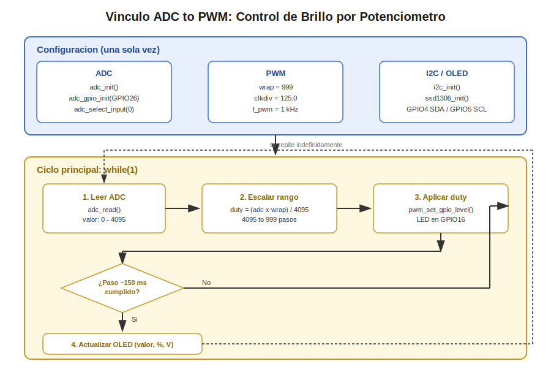
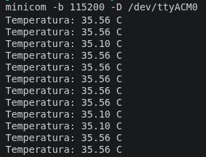

# Control de Brillo de un LED mediante Potenciometro (ADC + PWM + OLED)

Esta aplicacion integra tres perifericos ya estudiados de forma independiente en "Periféricos Básicos" —ADC, PWM e I2C— en un unico flujo de control en tiempo real: la posicion de un potenciometro externo, leida por el ADC, determina el ciclo de trabajo de una senal PWM que modula el brillo de un LED, mientras que un display OLED muestra de forma simultanea el valor crudo, el porcentaje y el voltaje estimado de la lectura. A diferencia de las practicas de "Periféricos Básicos", donde cada periferico se estudia de forma aislada, aqui el objetivo es mostrar como se construye, exclusivamente en software, el vinculo entre una entrada analogica y una salida de control.

## Concepto Teorico

El RP2040 no posee una conexion interna que enlace de forma automatica un canal ADC con un slice PWM: dicho enlace es enteramente una construccion de software, realizada dentro del ciclo principal del programa. El patron es el siguiente:

1. **Muestreo**: el controlador ADC realiza una conversion por aproximaciones sucesivas de la tension presente en el pin de entrada (el cursor del potenciometro), entregando un valor digital de 12 bits (0-4095) proporcional a dicha tension, referenciada contra el voltaje de alimentacion del propio ADC.

2. **Reescalamiento**: el rango de 12 bits del ADC (0-4095) no coincide, en general, con el rango util del PWM, que esta determinado por el valor de `wrap` configurado en el contador del slice. Es necesaria una conversion de rango (regla de tres) para trasladar la lectura analogica al dominio del ciclo de trabajo.

3. **Aplicacion**: el valor reescalado se escribe en el registro de comparacion del canal PWM correspondiente. Este valor no modifica la senal de salida de forma instantanea; toma efecto en el siguiente periodo del contador del slice.

4. **Repeticion periodica**: como no existe una conexion por hardware entre ambos perifericos, el vinculo debe reconstruirse de forma continua dentro de un bucle: se lee, se reescala, se aplica, y se repite indefinidamente. Esta arquitectura por sondeo (*polling*) es suficiente para una variable que cambia a la velocidad con la que una persona gira una perilla —del orden de decenas de milisegundos— y evita la complejidad adicional de interrupciones o DMA, que solo se justificaria para tasas de muestreo mucho mayores.

Un efecto colateral relevante de esta arquitectura es la **perdida de resolucion por cuantizacion**: si el rango del ADC (4096 niveles) es mas fino que el rango del PWM (definido por `wrap + 1` niveles), varios valores consecutivos de la lectura analogica terminan mapeando al mismo nivel de ciclo de trabajo. Esta perdida es aceptable en esta aplicacion porque la percepcion humana del brillo de un LED no requiere una resolucion tan fina como la que entrega el ADC.

Adicionalmente, esta aplicacion introduce una **tasa de refresco desacoplada**: el par ADC-PWM se actualiza en cada iteracion del bucle (alta frecuencia, para que el LED responda con fluidez), mientras que el display OLED se actualiza a un intervalo mas espaciado, controlado por un temporizador de software basado en marcas de tiempo absolutas. Actualizar el OLED en cada iteracion del bucle no aportaria beneficio perceptible al usuario y consumiria innecesariamente ancho de banda del bus I2C.

<div align="center"></div>

### Calculo Cuantitativo

- **Frecuencia de PWM**: con `clk_sys = 125 MHz`, `wrap = 999` y `clkdiv = 125.0`, aplicando la misma formula usada en la practica basica de PWM (`f_pwm = clk_sys / (clkdiv × (wrap + 1))`), se obtiene `f_pwm = 125,000,000 / (125.0 × 1000) = 1000 Hz` exactos — muy por encima del umbral de fusion de parpadeo del ojo humano.
- **Resolucion de tension del ADC**: `3.3 V / 4095 ≈ 0.806 mV` por unidad menos significativa (LSB).
- **Factor de reescalamiento ADC-PWM**: `4095 / 999 ≈ 4.1`; es decir, cada paso de ciclo de trabajo del PWM agrupa aproximadamente 4 conteos consecutivos del ADC (perdida de resolucion de ~12 bits a ~10 bits efectivos, ver Analisis del Codigo).
- **Presupuesto del bus I2C**: reutilizando el costo de refresco de pantalla completa calculado en la aplicacion de temperatura (~23.1 ms por transferencia), un intervalo de refresco de 150 ms implica que el bus I2C esta ocupado por el OLED durante aproximadamente 23.1/150 ≈ 15.4% del tiempo, dejando margen amplio para el resto del ciclo.

## Hardware y Conexiones

| Componente | Pin RP2040 | Notas |
|---|---|---|
| Potenciometro (cursor / wiper) | GPIO26 (ADC0) | Extremos del potenciometro a 3.3V y GND |
| LED (con resistencia limitadora) | GPIO16 (PWM, slice 0, canal A) | Catodo a GND a traves de la resistencia |
| OLED SSD1306 — SDA | GPIO4 (I2C0 SDA) | Pull-up interno habilitado por software |
| OLED SSD1306 — SCL | GPIO5 (I2C0 SCL) | Pull-up interno habilitado por software |
| OLED SSD1306 — VCC / GND | 3.3V / GND | — |

## Dependencias de Software

Esta aplicacion reutiliza la misma biblioteca de terceros empleada en la aplicacion de temperatura con OLED:

| Campo | Detalle |
|---|---|
| Nombre | `pico-ssd1306` |
| Autor | David Schramm (`daschr`) |
| Licencia | MIT |
| Repositorio | https://github.com/daschr/pico-ssd1306 |
| Funciones de la API utilizadas | `ssd1306_init`, `ssd1306_clear`, `ssd1306_draw_string`, `ssd1306_show` |

El codigo fuente de la biblioteca no se reproduce en este documento; se referencia unicamente su integracion en el proyecto.

## Configuracion del Proyecto — CMake

A diferencia de "Periféricos Básicos", donde solo se muestra el fragmento de `target_link_libraries`, en "Aplicaciones e Integración" se documenta la seccion completa de fuentes del proyecto, dado que involucra una biblioteca de terceros:

```cmake
add_executable(app02_adc_pwm_potenciometro
    main.c
    ssd1306.c
)

target_include_directories(app02_adc_pwm_potenciometro PRIVATE
    ${CMAKE_CURRENT_LIST_DIR}
)

target_link_libraries(app02_adc_pwm_potenciometro
    pico_stdlib
    hardware_adc
    hardware_pwm
    hardware_i2c
)

pico_add_extra_outputs(app02_adc_pwm_potenciometro)
```

## Codigo Fuente

```c
/**
 * @file main.c
 * @author obviousfancy
 * @board pico
 * @sdk Raspberry Pi Pico SDK 2.2.0
 */

#include <stdio.h>
#include "pico/stdlib.h"
#include "pico/time.h"
#include "hardware/adc.h"
#include "hardware/pwm.h"
#include "hardware/i2c.h"
#include "ssd1306.h"

// --- Asignacion de pines ---
#define ADC_PIN 26
#define ADC_CHANNEL 0
#define PWM_PIN 16
#define I2C_PORT i2c0
#define I2C_SDA 4
#define I2C_SCL 5
#define OLED_ADDRESS 0x3C

// --- Parametros de PWM (f_pwm = 1 kHz exacto) ---
#define PWM_WRAP 999
#define PWM_CLKDIV 125.0f

// --- Referencias del ADC ---
#define ADC_MAX 4095.0f
#define ADC_VREF 3.3f

// --- Tasa de refresco del OLED, independiente del bucle principal ---
#define OLED_REFRESH_MS 150

int main(void) {
    stdio_init_all();

    // --- Inicializacion ADC ---
    adc_init();
    adc_gpio_init(ADC_PIN);
    adc_select_input(ADC_CHANNEL);

    // --- Inicializacion PWM ---
    gpio_set_function(PWM_PIN, GPIO_FUNC_PWM);
    uint slice_num = pwm_gpio_to_slice_num(PWM_PIN);

    pwm_config config = pwm_get_default_config();
    pwm_config_set_clkdiv(&config, PWM_CLKDIV);
    pwm_config_set_wrap(&config, PWM_WRAP);
    pwm_init(slice_num, &config, true);

    // --- Inicializacion I2C y OLED ---
    i2c_init(I2C_PORT, 400 * 1000);
    gpio_set_function(I2C_SDA, GPIO_FUNC_I2C);
    gpio_set_function(I2C_SCL, GPIO_FUNC_I2C);
    gpio_pull_up(I2C_SDA);
    gpio_pull_up(I2C_SCL);

    ssd1306_t oled;
    oled.external_vcc = false;
    ssd1306_init(&oled, 128, 64, OLED_ADDRESS, I2C_PORT);
    ssd1306_clear(&oled);

    absolute_time_t next_refresh = get_absolute_time();
    char line_raw[24];
    char line_pct[24];
    char line_volt[24];

    while (1) {
        // 1. Lectura del ADC (0 - 4095)
        uint16_t adc_raw = adc_read();

        // 2. Reescalamiento de rango: 4096 niveles de ADC a (wrap + 1) niveles de PWM
        uint16_t duty = (uint32_t)(adc_raw * PWM_WRAP) / (uint32_t)ADC_MAX;

        // 3. Aplicacion del ciclo de trabajo
        pwm_set_gpio_level(PWM_PIN, duty);

        // 4. Actualizacion del OLED a tasa independiente y mas lenta
        if (absolute_time_diff_us(get_absolute_time(), next_refresh) <= 0) {
            float percentage = (adc_raw * 100.0f) / ADC_MAX;
            float voltage = (adc_raw * ADC_VREF) / ADC_MAX;

            snprintf(line_raw, sizeof(line_raw), "Raw:  %u", adc_raw);
            snprintf(line_pct, sizeof(line_pct), "Pct:  %.1f %%", percentage);
            snprintf(line_volt, sizeof(line_volt), "Volt: %.2f V", voltage);

            ssd1306_clear(&oled);
            ssd1306_draw_string(&oled, 0, 0, 1, line_raw);
            ssd1306_draw_string(&oled, 0, 20, 1, line_pct);
            ssd1306_draw_string(&oled, 0, 40, 1, line_volt);
            ssd1306_show(&oled);

            next_refresh = make_timeout_time_ms(OLED_REFRESH_MS);
        }

        // Ritmo de muestreo del par ADC-PWM (mas rapido que el refresco del OLED)
        sleep_ms(15);
    }

    return 0;
}
```

## Analisis del Codigo

- **`adc_select_input(0)`**: selecciona el canal 0, correspondiente a GPIO26, primer canal externo disponible (distinto del canal 4 usado en la practica basica de ADC, reservado al sensor de temperatura interno).

- **Reescalamiento (`duty = (adc_raw * PWM_WRAP) / ADC_MAX`)**: es la unica forma correcta de trasladar un rango de 4096 niveles a uno de 1000 niveles (`wrap + 1`); una asignacion directa del valor del ADC al registro de comparacion del PWM saturaria o desbordaria el contador, dado que 4095 excede el valor de `wrap` configurado. La multiplicacion se realiza antes de la division, y en una variable de 32 bits, para evitar tanto la perdida de precision como el desbordamiento intermedio del calculo.

- **Perdida de resolucion por cuantizacion**: con `wrap = 999`, el factor de reescalamiento es 4095/999 ≈ 4.1; es decir, aproximadamente 4 valores consecutivos del ADC producen el mismo nivel de PWM. Esta perdida —de una resolucion nominal de 12 bits a una resolucion efectiva cercana a 10 bits— es imperceptible para el ojo humano en el control de brillo de un LED, y se documenta explicitamente para que quede claro que no es un error, sino una decision de diseno.

- **`absolute_time_t` / `absolute_time_diff_us` / `make_timeout_time_ms`**: mecanismo de temporizador de software no bloqueante, ya utilizado conceptualmente en la practica de Timer, aqui aplicado para desacoplar la tasa de refresco del OLED (150 ms) de la tasa de muestreo del par ADC-PWM (15 ms). Esto evita saturar el bus I2C con actualizaciones mas frecuentes de lo que un observador humano puede percibir.

- **`ssd1306_clear` + `ssd1306_draw_string` + `ssd1306_show`**: patron ya establecido en la aplicacion de temperatura — se compone el contenido en el framebuffer local y se transfiere al controlador del display en una sola operacion I2C por refresco, en lugar de escribir caracter por caracter.

## Verificacion

Al girar el potenciometro de un extremo a otro, debe observarse:

1. El LED conectado a GPIO16 varia su brillo de forma continua y proporcional a la posicion del cursor, sin parpadeo perceptible (frecuencia de PWM de 1 kHz).
2. El display OLED actualiza, aproximadamente cada 150 ms, tres lineas: el valor crudo del ADC (0-4095), el porcentaje equivalente (0.0-100.0%) y el voltaje estimado (0.00-3.30 V).
3. Los tres valores mostrados en el OLED son consistentes entre si en todo momento (el porcentaje y el voltaje son transformaciones directas del valor crudo).

<div align="center"></div>

## Errores Comunes

| Sintoma | Causa Tipica |
|---|---|
| El LED permanece siempre al maximo o siempre apagado | El potenciometro esta conectado como divisor fijo (cursor no conectado a GPIO26), o los extremos estan invertidos entre 3.3V y GND |
| El OLED no muestra nada | Direccion I2C incorrecta (verificar contra el escaneo de bus de la practica de I2C), o pull-ups no habilitados en SDA/SCL |
| El brillo del LED cambia a saltos notorios en vez de forma continua | Valor de `wrap` demasiado bajo para la resolucion deseada, o reescalamiento omitido (asignacion directa del valor crudo del ADC al PWM) |
| El OLED se actualiza con parpadeo o parece "trabado" | Intervalo de refresco (`OLED_REFRESH_MS`) configurado demasiado bajo, saturando el bus I2C |

### Variantes

1. Agregar un segundo potenciometro en un canal ADC distinto (por ejemplo GPIO27 / ADC1) para controlar un segundo LED en un pin PWM independiente, verificando que ambos slices no interfieran entre si.
2. Sustituir el mapeo lineal por una curva de brillo perceptual (por ejemplo, elevando el valor reescalado a una potencia antes de aplicarlo al PWM), y comparar la sensacion de linealidad de brillo percibido contra la version original.
3. Agregar histeresis por software a la lectura del ADC (por ejemplo, ignorar variaciones menores a un umbral de unos pocos conteos) para eliminar el parpadeo del ultimo digito mostrado en el OLED causado por el ruido natural de la conversion analogica.
