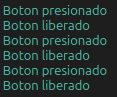

# GPIO: Lectura de una entrada digital

Una vez cubiertas la salida digital (Blink) y la comunicación por USB (Serial), esta práctica aborda el caso complementario: la lectura del estado de un botón de panel. Detectar el estado de un pulsador, un interruptor o un sensor de contacto es una de las operaciones más frecuentes en cualquier sistema embebido, y sienta además las bases necesarias para abordar las interrupciones externas en la práctica siguiente (IRQ).

## Concepto Teórico

A diferencia de la salida digital ya cubierta en Blink, la lectura de una entrada consulta, en cada instante, el nivel eléctrico presente en el pin mediante `gpio_get()`. Esta función puede entenderse como una máscara (*bitmask*) aplicada sobre el estado completo del puerto: internamente extrae el bit correspondiente al número de pin solicitado, de la misma manera en que podrían leerse varios pines a la vez consultando `gpio_get_all()` y aplicando la máscara adecuada a los bits de interés.
 
Un pin configurado como entrada queda además expuesto a un estado indeterminado (*flotante*) cuando no existe una conexión física definida hacia una fuente de voltaje o tierra; para evitarlo, el RP2040 incorpora resistencias de pull-up y pull-down programables en cada pin, habilitables por software mediante `gpio_pull_up()` o `gpio_pull_down()`, sin necesidad de una resistencia física externa. Cada entrada también puede configurarse con histéresis (disparador Schmitt) —habilitada por defecto—, la cual añade un margen entre los umbrales de detección de nivel alto y bajo; esto resulta útil frente a señales ruidosas o de transición lenta, ya que reduce la probabilidad de que el ruido eléctrico por sí solo provoque transiciones espurias. Esto es distinto del rebote de contacto: al presionar o soltar un botón mecánico, la señal no transiciona de manera limpia entre los dos niveles lógicos, sino que oscila brevemente antes de estabilizarse, un fenómeno mecánico que la histéresis por sí sola no resuelve. El criterio de antirrebote más simple consiste en, tras detectar un cambio de estado, esperar un breve intervalo antes de aceptar la nueva lectura como válida. El muestreo periódico (*polling*) empleado en esta práctica no es la única forma de detectar estos cambios — las interrupciones externas, más eficientes, se abordan en la práctica siguiente (IRQ).

## Hardware y Conexiones

| Elemento | Pin del RP2040 | Descripción |
|---|---|---|
| Botón de panel | GPIO24 | Un extremo se conecta al pin; el otro, a GND. Se utiliza el pull-up interno del RP2040, por lo que no se requiere resistencia externa |

## Configuración del Proyecto (CMake)

```cmake
target_link_libraries(${PROJECT_NAME}
    pico_stdlib
    hardware_gpio
)
```

## Código Fuente

```c
/**
 * @file main.c
 * @brief Lectura de una entrada digital (boton) con pull-up y antirrebote simple
 *
 * @author obviousfancy
 * @board  pico
 * @sdk    Raspberry Pi Pico SDK 2.2.0
 */

/* ─── Includes ─────────────────────────────────────────── */
#include <stdio.h>
#include "pico/stdlib.h"
#include "hardware/gpio.h"

/* ─── Defines ──────────────────────────────────────────── */
#define BUTTON_PIN 24

/* ─── Main ─────────────────────────────────────────────── */
int main() {
    stdio_init_all();

    gpio_init(BUTTON_PIN);
    gpio_set_dir(BUTTON_PIN, GPIO_IN);
    gpio_pull_up(BUTTON_PIN);
    // La entrada admite histeresis (disparador Schmitt) para filtrar ruido
    // electrico alrededor del umbral de conmutacion; ya viene habilitada
    // por defecto, por lo que no es necesario activarla explicitamente:
    // gpio_set_input_hysteresis_enabled(BUTTON_PIN, true);

    bool estado_anterior = gpio_get(BUTTON_PIN);

    while (1) {
        bool estado_actual = gpio_get(BUTTON_PIN);

        if (estado_actual != estado_anterior) {
            if (estado_actual) {
                printf("Boton liberado\n");
            } else {
                printf("Boton presionado\n");
            }
            estado_anterior = estado_actual;
        }

        sleep_ms(20);  // Margen de antirrebote
    }
}
```

## Análisis del Código

`gpio_pull_up()` habilita la resistencia de pull-up interna sobre `BUTTON_PIN`, evitando que el pin quede en estado flotante mientras el botón no está presionado. La línea comentada muestra cómo se activaría explícitamente `gpio_set_input_hysteresis_enabled()`, aunque no es necesario hacerlo: la histéresis ya está habilitada por defecto, y su función —filtrar variaciones eléctricas pequeñas alrededor del umbral de conmutación— es, como ya se señaló, independiente del rebote mecánico del contacto, que se atiende mediante el margen de 20 ms del ciclo principal. `gpio_get()` retorna el nivel lógico instantáneo del pin, aplicando internamente la máscara descrita en el Concepto Teórico. La comparación entre `estado_actual` y `estado_anterior` es lo que permite reportar únicamente los cambios de estado, en lugar de imprimir en cada iteración del ciclo; `stdio_init_all()` y `printf()` ya se cubrieron en la práctica de Serial y aquí simplemente se reutilizan para reportar el resultado.

## Verificación

Ábrase una terminal serial de su preferencia sobre el puerto USB-CDC que expone la placa (por ejemplo, `/dev/ttyACM0` en Linux) a 115200 baudios, en linux puede usarse:

```bash
minicom -b 115200 -D /dev/ttyACM0
```

Cada vez que se presione o se libere el botón debe imprimirse la línea correspondiente (`Boton presionado` o `Boton liberado`), de manera inmediata y sin líneas duplicadas ni ausentes.

<div align="center">
  
  <p><em>Salida esperada en la terminal serial</em></p>
</div>

## Errores Comunes y Variantes

| Síntoma | Causa típica |
|---|---|
| El pin lee estados aleatorios sin presionar el botón | Falta la llamada a `gpio_pull_up()`; el pin permanece en estado flotante |
| No se observa nada en la terminal | `pico_enable_stdio_usb` no está habilitado con el valor `1`, o se está monitoreando el puerto serial equivocado |
| El mensaje impreso no corresponde al estado físico del botón | Lógica invertida: revísese la comparación de `estado_actual`, considerando que el pull-up produce un `1` en reposo y un `0` al presionar |

**Variantes:**

- Agregar un contador de pulsaciones y mostrarlo cada vez que su valor cambie.
- Emplear el botón para alternar el parpadeo del LED de la práctica de Blink, en vez de solo reportar su estado por serial.
- Aumentar deliberadamente el intervalo de antirrebote (por ejemplo, a 200 ms) y observar el efecto sobre la capacidad de detectar pulsaciones rápidas y consecutivas.
