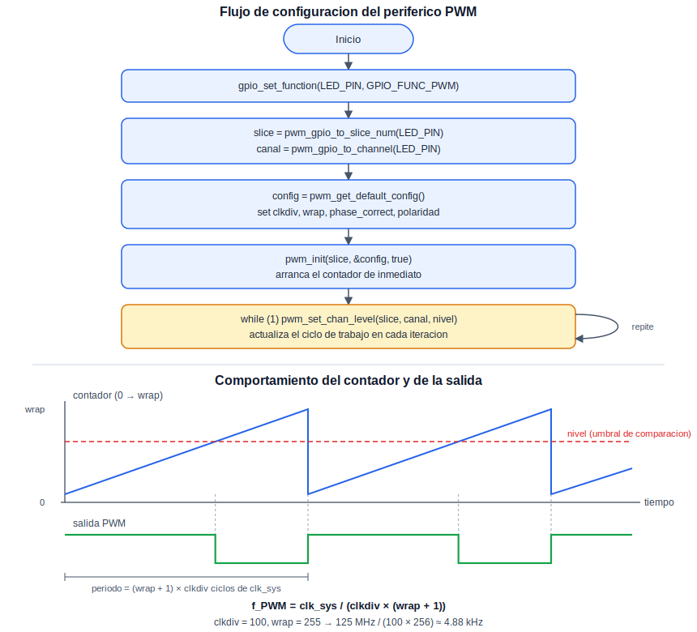
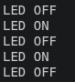

# PWM: Modulación de Pulsos

Esta práctica introduce el periférico PWM (*Pulse Width Modulation*) del RP2040, empleado para controlar de manera gradual la potencia entregada a una carga —el brillo de un LED, la velocidad de un motor, o la posición de un servomotor— sin necesidad de una salida verdaderamente analógica. Se reutiliza el LED integrado de la práctica de Blink, ahora atenuado de manera progresiva en lugar de simplemente encendido o apagado.

## Concepto Teórico

Cada *slice* de PWM del RP2040 contiene un contador que se incrementa en cada ciclo de una señal de reloj derivada del reloj del sistema mediante un divisor fraccionario configurable; al alcanzar un valor máximo programable (el periodo, o *wrap*), el contador reinicia desde cero. Dentro de cada slice, dos canales de salida (A y B) comparan, de manera independiente, el valor instantáneo del contador contra un nivel programado: la salida permanece en un nivel lógico mientras el contador es menor que ese nivel, y conmuta al nivel opuesto durante el resto del ciclo. La proporción entre ese nivel programado y el periodo completo es, precisamente, el ciclo de trabajo (*duty cycle*): variarlo de manera gradual, como se hace en esta práctica, produce el efecto de atenuación progresiva sobre un LED, ya que el ojo humano percibe el promedio de tiempo encendido en cada ciclo, no las conmutaciones individuales, que ocurren a una frecuencia muy superior a la perceptible.

El RP2040 dispone de ocho slices de PWM, y cada pin GPIO tiene asignado, de fábrica, un slice y un canal específicos —relación fija que el SDK resuelve mediante `pwm_gpio_to_slice_num()` y `pwm_gpio_to_channel()`, en lugar de requerir que el programador la calcule manualmente. Adicionalmente, cada slice admite un modo de conteo simétrico (*phase correct*), en el que el contador sube y baja en lugar de reiniciar abruptamente; esto centra los flancos de conmutación dentro del periodo, lo cual resulta relevante en aplicaciones más sensibles al contenido armónico de la señal, como el control de motores.

El siguiente diagrama resume la secuencia de configuración empleada en el código de esta práctica, y ejemplifica la relación entre el contador interno del slice, el nivel programado y la señal de salida resultante:

<div align="center">
  
</div>

**Cálculo de la frecuencia resultante.** El contador de un slice se incrementa una vez cada `clkdiv` ciclos del reloj del sistema (`clk_sys`, típicamente 125 MHz en el RP2040), y completa un periodo completo cada `wrap + 1` incrementos. De ahí que la frecuencia de la señal PWM resultante se obtenga mediante:

```
f_PWM = clk_sys / (clkdiv × (wrap + 1))
```

Para los valores empleados en el código de esta práctica (`clkdiv = 100`, `wrap = 255`):

```
f_PWM = 125 000 000 / (100 × 256) ≈ 4882 Hz ≈ 4.88 kHz
```

De manera análoga, el ciclo de trabajo resultante en cualquier instante es `duty = nivel / (wrap + 1)`. Esto evidencia una relación de compromiso entre frecuencia y resolución: para una velocidad de reloj fija, aumentar `wrap` ofrece más niveles intermedios de brillo (mayor resolución del ciclo de trabajo), pero reduce la frecuencia resultante, y viceversa. Cabe señalar que `clkdiv` se representa internamente en un formato de punto fijo de 8 bits enteros y 4 bits fraccionarios, por lo que admite valores entre 1.0 y 255.9375, en incrementos de 1/16 — de ahí que, aunque `pwm_config_set_clkdiv()` reciba un `float`, no cualquier valor decimal se representa de forma exacta.

## Hardware y Conexiones

| Elemento | Pin del RP2040 | Descripción |
|---|---|---|
| LED integrado | GPIO25 | Mismo LED de la práctica de Blink; ahora controlado por PWM en lugar de encendido/apagado directo |

## Configuración del Proyecto (CMake)

```cmake
target_link_libraries(${PROJECT_NAME}
    pico_stdlib
    hardware_pwm
)
```

## Código Fuente

```c
/**
 * @file Practice_PWM_06.c
 * @brief Atenuacion progresiva del LED integrado mediante PWM
 *
 * @author obviousfancy
 * @board  pico
 * @sdk    Raspberry Pi Pico SDK 2.2.0
 */

/* ─── Includes ─────────────────────────────────────────── */
#include "pico/stdlib.h"
#include "hardware/pwm.h"

/* ─── Defines ──────────────────────────────────────────── */
#define LED_PIN 25

/* ─── Main ─────────────────────────────────────────────── */
int main() {
    gpio_set_function(LED_PIN, GPIO_FUNC_PWM);

    uint slice   = pwm_gpio_to_slice_num(LED_PIN);
    uint channel = pwm_gpio_to_channel(LED_PIN);

    // Configuracion completa del slice, aunque esta practica solo
    // varie el nivel de un canal de forma gradual:
    pwm_config config = pwm_get_default_config();
    pwm_config_set_clkdiv(&config, 100.0f);                  // Divisor de reloj
    pwm_config_set_wrap(&config, 255);                        // Periodo del contador: 256 pasos (0-255)
    pwm_config_set_phase_correct(&config, false);             // Conteo simple (no simetrico)
    pwm_config_set_output_polarity(&config, false, false);    // Polaridad normal en ambos canales

    pwm_init(slice, &config, true);  // true = arrancar de inmediato

    int nivel = 0;
    int paso = 5;

    while (1) {
        pwm_set_chan_level(slice, channel, (uint16_t)nivel);

        nivel += paso;
        if (nivel >= 255) { nivel = 255; paso = -paso; }
        else if (nivel <= 0) { nivel = 0; paso = -paso; }

        sleep_ms(15);
    }
}
```

## Análisis del Código

`gpio_set_function(LED_PIN, GPIO_FUNC_PWM)` desconecta el pin del control GPIO simple empleado en Blink y lo asigna al periférico PWM. `pwm_gpio_to_slice_num()` y `pwm_gpio_to_channel()` obtienen el slice y canal que corresponden a `LED_PIN`, evitando calcularlos manualmente. `pwm_get_default_config()` produce una configuración base, sobre la cual `pwm_config_set_clkdiv()` fija la velocidad del contador y `pwm_config_set_wrap()` fija su periodo; conforme a la fórmula presentada en el Concepto Teórico, estos valores concretos (`clkdiv = 100`, `wrap = 255`) producen una frecuencia de PWM de aproximadamente 4.88 kHz, con una resolución de 256 niveles posibles (0 a 255) para el ciclo de trabajo. `pwm_config_set_phase_correct(false)` mantiene el conteo simple descrito en el Concepto Teórico, suficiente para atenuar un LED. `pwm_config_set_output_polarity()` se deja en su valor normal para ambos canales; invertirla haría que el LED brillara más con niveles bajos en lugar de altos. `pwm_init(slice, &config, true)` aplica la configuración y arranca el slice de inmediato.

Dentro del ciclo principal, `pwm_set_chan_level()` actualiza el nivel de comparación del canal en cada iteración, mientras que `nivel` y `paso` implementan un barrido simple de ida y vuelta entre 0 y 255. El propio periférico también admite generar una interrupción al completar cada periodo (`pwm_set_irq_enabled()`), útil para actualizar el nivel de manera más precisa sin depender de `sleep_ms()`; no se emplea en esta práctica introductoria.

## Verificación

El LED integrado debe brillar cada vez más hasta alcanzar su intensidad máxima, y después atenuarse gradualmente hasta apagarse, repitiendo este ciclo de manera continua, sin parpadeo perceptible durante las transiciones.

<div align="center">
  
  <p><em>Estado esperado del LED integrado durante la práctica</em></p>
</div>

## Errores Comunes y Variantes

| Síntoma | Causa típica |
|---|---|
| El LED permanece siempre encendido o siempre apagado, sin variación | Falta `gpio_set_function(LED_PIN, GPIO_FUNC_PWM)`; el pin sigue bajo control de GPIO simple |
| El LED parpadea de forma visible en vez de atenuarse suavemente | Frecuencia de PWM demasiado baja para la combinación de `clkdiv`/`wrap` empleada |
| Error de *linking* durante la compilación | Ausencia de `hardware_pwm` en `target_link_libraries` |

**Variantes:**

- Modificar `clkdiv` y `wrap` para obtener una frecuencia de PWM distinta, y observar a partir de qué valores el parpadeo se vuelve perceptible.
- Controlar el brillo del LED con el botón de la práctica de GPIO, en lugar de un barrido automático.
- Generar dos señales PWM simultáneas —por ejemplo, en los dos canales de un mismo slice— con ciclos de trabajo distintos entre sí.
