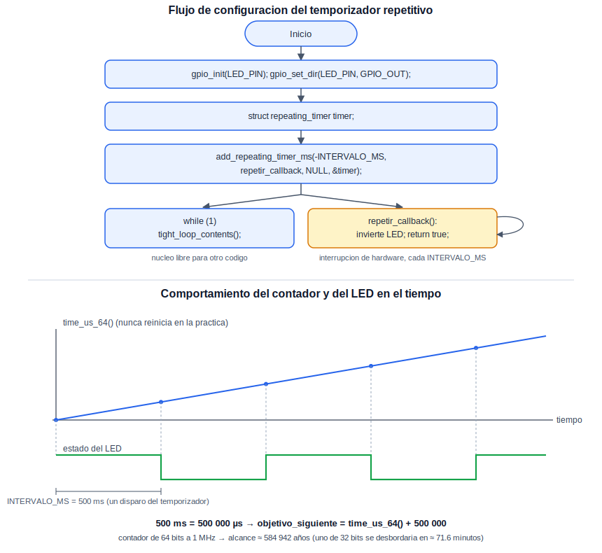

# Timer: Temporización de Hardware

Esta práctica introduce el temporizador de hardware del RP2040 para ejecutar una tarea de manera periódica —en este caso, alternar el LED integrado— sin bloquear el programa principal mediante `sleep_ms()`, a diferencia de como se hizo en Blink. Poder programar tareas periódicas sin detener el resto del programa es indispensable en cualquier sistema que deba atender varias responsabilidades a la vez: muestrear un sensor cada cierto intervalo, parpadear un indicador, o generar un tiempo límite (*timeout*) mientras se espera una respuesta externa.

## Concepto Teórico

El RP2040 cuenta con un único periférico de temporización, cuyo elemento central es un contador de 64 bits que se incrementa una vez por microsegundo, de manera continua desde el arranque de la placa; este contador es, de hecho, la misma fuente que utilizan `time_us_64()` y, en última instancia, `sleep_ms()`. Sobre este contador continuo operan varias alarmas de hardware, cada una capaz de comparar el valor del contador contra un objetivo programado y generar una interrupción al alcanzarlo. Por sí sola, una alarma de hardware es un mecanismo de disparo único (*one-shot*): para lograr un comportamiento periódico, es la propia capa de software del SDK la que, cada vez que una alarma se dispara, reprograma automáticamente la siguiente, dando la apariencia de una repetición continua.

Esto es exactamente lo que hace `add_repeating_timer_ms()`, empleada en esta práctica: registra una función de retrollamada (*callback*) que el SDK invoca a cada intervalo, y reprograma la siguiente invocación de manera automática mientras dicha retrollamada retorne `true`. El signo del intervalo tiene un significado propio: un valor negativo programa la siguiente invocación a un intervalo fijo contado desde el **inicio** de la invocación anterior (periodo verdaderamente constante, independientemente de cuánto tarde el callback en ejecutarse); un valor positivo, en cambio, programa la siguiente invocación contada desde el **final** de la invocación anterior, de modo que un callback más lento alarga el periodo real. Esta práctica utiliza un valor negativo, para obtener un parpadeo de periodo constante.

El siguiente diagrama resume la secuencia de configuración empleada en el código, y ejemplifica la relación entre el contador continuo del temporizador, los disparos periódicos de la alarma, y el estado resultante del LED:

<div align="center">
  
</div>

**Cálculo del intervalo interno.** El SDK expresa `add_repeating_timer_ms()` en milisegundos por conveniencia, pero internamente todo se maneja en microsegundos, la unidad nativa del contador. Para el intervalo empleado en esta práctica:

```
500 ms = 500 × 1000 = 500 000 µs
objetivo_siguiente = time_us_64() + 500 000
```

es decir, cada vez que el callback se ejecuta, el SDK programa la siguiente alarma exactamente 500 000 microsegundos después del instante de referencia correspondiente.

**¿Por qué un contador de 64 bits?** A 1 MHz, un contador de 32 bits se desbordaría (volvería a cero) después de `2^32 / 1 000 000 ≈ 4295` segundos, es decir, poco más de **71.6 minutos** de funcionamiento continuo —un problema real para un sistema que deba operar por periodos largos sin reiniciar su noción del tiempo—. Un contador de 64 bits, en cambio, se desborda después de `2^64 / 1 000 000` segundos, equivalentes a aproximadamente **584 942 años**, un margen que en la práctica elimina esta preocupación por completo.

## Hardware y Conexiones

| Elemento | Pin del RP2040 | Descripción |
|---|---|---|
| LED integrado | GPIO25 | Mismo LED de la práctica de Blink; ahora alternado mediante un temporizador de hardware en lugar de `sleep_ms()` |

## Configuración del Proyecto (CMake)

Esta práctica no requiere ninguna librería `hardware_*` adicional: la funcionalidad de temporización de alto nivel (`add_repeating_timer_ms`) forma parte de `pico_stdlib` a través de su dependencia `pico_time`.

```cmake
target_link_libraries(${PROJECT_NAME}
    pico_stdlib
)
```

## Código Fuente

```c
/**
 * @file Practice_Timer_07.c
 * @brief Parpadeo del LED integrado mediante un temporizador repetitivo de hardware
 *
 * @author obviousfancylab
 * @board  pico
 * @sdk    Raspberry Pi Pico SDK 2.2.0
 */

/* ─── Includes ─────────────────────────────────────────── */
#include "pico/stdlib.h"

/* ─── Defines ──────────────────────────────────────────── */
#define LED_PIN        25
#define INTERVALO_MS   500

/* ─── Callback del temporizador ────────────────────────────
 * Se invoca automaticamente cada INTERVALO_MS. Retornar
 * "true" indica al SDK que debe programar la siguiente
 * repeticion; retornar "false" la cancelaria.
 */
bool repetir_callback(struct repeating_timer *t) {
    static bool estado = false;
    estado = !estado;
    gpio_put(LED_PIN, estado);
    return true;
}

/* ─── Main ─────────────────────────────────────────────── */
int main() {
    gpio_init(LED_PIN);
    gpio_set_dir(LED_PIN, GPIO_OUT);

    struct repeating_timer timer;
    add_repeating_timer_ms(-INTERVALO_MS, repetir_callback, NULL, &timer);

    while (1) {
        // El nucleo permanece libre: el parpadeo ocurre por
        // interrupcion de hardware, no por espera bloqueante.
        tight_loop_contents();
    }
}
```

## Análisis del Código

`gpio_init()` y `gpio_set_dir()` preparan el LED exactamente igual que en Blink. `struct repeating_timer timer` reserva el espacio que el SDK utiliza internamente para llevar el control de esta alarma en particular; se pasa por referencia a `add_repeating_timer_ms()`, que la inicializa. El intervalo se expresa como `-INTERVALO_MS` —negativo, conforme a lo explicado en el Concepto Teórico— para garantizar un periodo constante de 500 ms entre invocaciones, independientemente de la duración del propio callback. `repetir_callback()` recibe un puntero a la estructura del temporizador (no utilizado en este caso) y retorna `bool`: `true` indica que la repetición debe continuar; retornar `false` en algún momento cancelaría el temporizador de forma permanente. Dentro del ciclo principal, `tight_loop_contents()` documenta la intención de dejarlo vacío, ya que toda la lógica relevante ocurre de forma asíncrona dentro del callback.

## Verificación

El LED integrado debe encender y apagar cada 500 ms, de manera indistinguible en apariencia del resultado de Blink. La diferencia no es visual sino de diseño: el parpadeo ya no depende de que el ciclo principal permanezca disponible para ejecutar `sleep_ms()`, sino que ocurre de forma independiente mediante una interrupción de hardware.

<div align="center">
  
  <p><em>Estado esperado del LED integrado durante la práctica</em></p>
</div>

## Errores Comunes y Variantes

| Síntoma | Causa típica |
|---|---|
| El LED nunca parpadea | `repetir_callback()` no retorna `true`, o la variable `timer` se declaró con un tiempo de vida incorrecto (por ejemplo, dentro de un bloque que termina antes de que el temporizador dispare) |
| El parpadeo se percibe con un periodo distinto al programado | Se utilizó un valor positivo de `INTERVALO_MS` junto con un callback cuya duración no es despreciable frente al intervalo |
| Error de compilación relacionado con `repeating_timer` | Falta el include de `pico/stdlib.h`, que arrastra la definición de `pico_time` |

**Variantes:**

- Agregar, dentro del ciclo principal, una tarea que tome varios milisegundos (por ejemplo, un conteo largo) y confirmar que el LED sigue parpadeando puntualmente pese a ello.
- Cambiar `-INTERVALO_MS` por `INTERVALO_MS` (positivo) y, dentro del callback, insertar una demora artificial para observar cómo se distorsiona el periodo real.
- Cancelar el temporizador mediante `cancel_repeating_timer()` al presionar el botón de la práctica de GPIO, combinando ambas prácticas.
