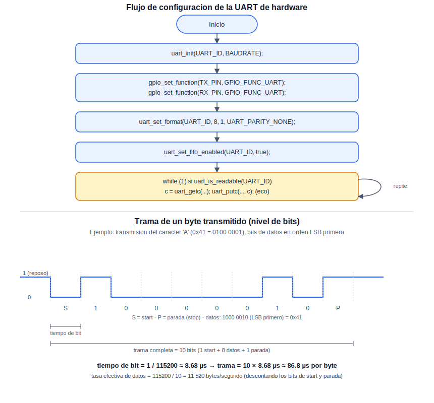

# UART: Comunicación Serial Asíncrona

Esta práctica introduce el periférico UART de hardware del RP2040 —distinto del puerto serial virtual sobre USB ya utilizado en la práctica de Serial—, empleado para comunicarse con dispositivos externos reales: módulos GPS, sensores, adaptadores Bluetooth o Wi-Fi, u otros microcontroladores. Para esta verificación se aprovecha el conversor USB-serial CH340 disponible en el UNIT DevLab MultiHub Shield: la UART0 del RP2040 se conecta a él en cruce (TX con RX, RX con TX), de modo que una terminal abierta sobre el puerto que expone el CH340 permita enviar y recibir datos reales hacia y desde la placa.

## Concepto Teórico

A diferencia de I2C o SPI, la UART es un protocolo asíncrono: no existe una línea de reloj compartida entre transmisor y receptor, por lo que ambos deben acordar de antemano la velocidad de transmisión (*baudrate*, en bits por segundo) para interpretar correctamente la señal. Para delimitar dónde inicia y termina cada byte sobre una línea que, en reposo, permanece en nivel alto, cada trama agrega un bit de inicio (*start*, siempre en nivel bajo) antes de los bits de datos, y uno o más bits de parada (*stop*, en nivel alto) al final. El formato empleado en esta práctica —8 bits de datos, sin paridad, 1 bit de parada— se abrevia como "8N1", y es el más común en la práctica.

El siguiente diagrama resume la configuración empleada en el código y muestra, a nivel de bits, cómo se ve una trama completa sobre la línea:

<div align="center">
  
</div>

**Cálculo del tiempo de trama.** Con un *baudrate* de 115200 bits por segundo, el tiempo que ocupa un solo bit sobre la línea es:

```
tiempo_de_bit = 1 / 115200 ≈ 8.68 µs
```

Con el formato 8N1, cada byte transmitido ocupa 10 bits en total (1 de inicio + 8 de datos + 1 de parada), de modo que:

```
tiempo_de_trama = 10 × 8.68 µs ≈ 86.8 µs por byte
tasa_efectiva = 115200 / 10 = 11 520 bytes/segundo
```

Nótese que la tasa efectiva de datos (bytes útiles por segundo) es menor que el *baudrate* nominal, precisamente porque dos de cada diez bits transmitidos son de encuadre (inicio y parada) y no forman parte del dato. El RP2040 dispone de dos periféricos UART independientes (`uart0`, `uart1`), cada uno con una FIFO interna de hardware que amortigua ráfagas cortas de bytes sin requerir que el programa los atienda de manera inmediata.

## Hardware y Conexiones

| Señal (RP2040) | Pin del RP2040 | Conexión en el CH340 (Shield) |
|---|---|---|
| TX (UART0) | GP0 | RX del CH340 |
| RX (UART0) | GP1 | TX del CH340 |
| GND | GND | GND común (ya compartido a través del Shield) |

> **Nota:** las líneas se conectan en cruce —el TX de un extremo hacia el RX del otro—, como es habitual en cualquier enlace UART punto a punto; conectar TX con TX y RX con RX es un error común y evita toda comunicación.

## Configuración del Proyecto (CMake)

```cmake
target_link_libraries(${PROJECT_NAME}
    pico_stdlib
    hardware_uart
)
```

## Código Fuente

```c
/**
 * @file Practice_UART_08.c
 * @brief Eco por UART0 hacia el conversor USB-serial CH340 del Shield
 *
 * @author obviousfancylab
 * @board  pico
 * @sdk    Raspberry Pi Pico SDK 2.2.0
 */

/* ─── Includes ─────────────────────────────────────────── */
#include <stdio.h>
#include "pico/stdlib.h"
#include "hardware/uart.h"

/* ─── Defines ──────────────────────────────────────────── */
#define UART_ID    uart0
#define BAUDRATE   115200
#define TX_PIN     0
#define RX_PIN     1

/* ─── Main ─────────────────────────────────────────────── */
int main() {
    stdio_init_all();

    uint baud_real = uart_init(UART_ID, BAUDRATE);
    gpio_set_function(TX_PIN, GPIO_FUNC_UART);
    gpio_set_function(RX_PIN, GPIO_FUNC_UART);

    uart_set_format(UART_ID, 8, 1, UART_PARITY_NONE);  // 8N1
    uart_set_fifo_enabled(UART_ID, true);

    printf("Baudrate solicitado: %d, baudrate real: %u\n", BAUDRATE, baud_real);
    printf("Esperando caracteres desde el CH340...\n");

    while (1) {
        if (uart_is_readable(UART_ID)) {
            char recibido = uart_getc(UART_ID);
            uart_putc(UART_ID, recibido);                     // Eco de vuelta hacia el CH340
            printf("Recibido por UART0: '%c'\n", recibido);    // Reporte por USB
        }
    }
}
```

## Análisis del Código

`uart_init(UART_ID, BAUDRATE)` habilita el periférico y configura el generador de baudrate; retorna la velocidad real alcanzada, que puede diferir ligeramente de la solicitada, ya que internamente se deriva de un divisor entero sobre el reloj del periférico y no todo valor de *baudrate* es exactamente representable. `gpio_set_function()` sobre ambos pines es indispensable: sin ella, GP0 y GP1 permanecen en su función GPIO por defecto y no quedan conectados al periférico UART. `uart_set_format(UART_ID, 8, 1, UART_PARITY_NONE)` fija el formato 8N1 descrito en el Concepto Teórico. `uart_set_fifo_enabled(true)` habilita el almacenamiento temporal de hardware, útil si el programa no atiende cada byte de inmediato.

Dentro del ciclo principal, `uart_is_readable(UART_ID)` consulta, sin bloquear, si hay al menos un byte disponible en la FIFO de recepción. Cuando lo hay, `uart_getc()` lo retira y `uart_putc()` lo retransmite de inmediato hacia el CH340 —de modo que cada carácter escrito en la terminal conectada a él se ve reflejado de vuelta—, mientras que el `printf` deja, además, un registro de cada carácter recibido sobre el puerto USB. A diferencia de una prueba de *loopback* consigo misma, aquí el ritmo de la comunicación lo marca por completo quien escribe en la terminal del CH340: el programa no transmite nada por iniciativa propia.

## Verificación

Esta práctica requiere dos terminales seriales abiertas de manera simultánea:

1. Sobre el puerto USB-CDC propio de la placa (por ejemplo, `/dev/ttyACM0` en Linux), a 115200 baudios, para observar el registro por `printf`:

   ```bash
   minicom -b 115200 -D /dev/ttyACM0
   ```

2. Sobre el puerto que expone el CH340 del Shield (por ejemplo, `/dev/ttyUSB0` en Linux — un dispositivo distinto al anterior), también a 115200 baudios, para escribir caracteres y observar su eco:

   ```bash
   minicom -b 115200 -D /dev/ttyUSB0
   ```

Al escribir cualquier carácter en la segunda terminal, debe verse reflejado de inmediato en esa misma terminal (el eco enviado por la placa), y debe aparecer también una línea `Recibido por UART0: 'X'` en la primera terminal, confirmando que el dato efectivamente llegó por RX y fue procesado por el programa.

<div align="center">
  
  <p><em>Salida esperada en la terminal serial</em></p>
</div>

## Errores Comunes y Variantes

| Síntoma | Causa típica |
|---|---|
| Nada de lo escrito en la terminal del CH340 se refleja de vuelta | Conexión TX/RX sin cruzar (TX con TX, RX con RX en vez de TX con RX); revísese también el GND común |
| Se recibe siempre el mismo carácter o datos corruptos | *Baudrate* configurado de forma distinta entre la terminal del CH340 y `BAUDRATE` en el código |
| Error de *linking* durante la compilación | Ausencia de `hardware_uart` en `target_link_libraries` |

**Variantes:**

- Cambiar `BAUDRATE` a distintos valores (configurando la terminal del CH340 igual en cada caso) y comparar, mediante `baud_real`, cuánto se aleja el valor efectivamente alcanzado del solicitado.
- Convertir los caracteres recibidos a mayúsculas antes de retransmitirlos, en lugar de un eco literal.
- Agregar un bit de paridad (`UART_PARITY_EVEN` en lugar de `UART_PARITY_NONE`) tanto en el código como en la configuración de la terminal, y forzar una discrepancia deliberada para observar su efecto.
