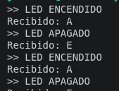

# Ejemplo 04: Comunicación I2C con display OLED

Tras cubrir la comunicación asíncrona por UART ([ejemplo 02](./07_uart.md)) y la conversión analógico-digital ([ejemplo 03](./04_adc.md)), la presente práctica introduce el bus I2C, un protocolo de comunicación síncrono que permite conectar múltiples dispositivos esclavos sobre únicamente dos líneas (datos y reloj). Como dispositivo esclavo se emplea un display OLED con conector QWIIC, lo que además introduce a los participantes en este estándar de interconexión, cada vez más común en módulos de desarrollo por su simplicidad de cableado.

## Objetivo general

Configurar el periférico I2C del RP2040 y verificar la comunicación con un dispositivo esclavo conectado mediante conector QWIIC —en este caso, un display OLED SSD1306— como paso previo indispensable a su control completo mediante el protocolo I2C.

> **Nota:** esta versión de la práctica cubre el escaneo del bus I2C como verificación inicial de la comunicación con el display. La rutina de inicialización del controlador SSD1306 y la escritura de contenido sobre el display se documentarán en una actualización posterior de este archivo, una vez validadas.

---

## Primera parte: Escaneo del bus I2C

### Objetivo específico

Inicializar el periférico I2C0 del RP2040 y realizar un barrido (escaneo) de las direcciones del bus, con el fin de confirmar que el dispositivo esclavo conectado responde en la dirección esperada, antes de implementar cualquier lógica de control sobre él.

### Hardware requerido

| Componente | Cantidad | Observaciones |
|---|---|---|
| Placa con RP2040 (Raspberry Pi Pico o equivalente) | 1 | Plataforma empleada en el Módulo II |
| Display OLED SSD1306 con conector QWIIC | 1 | En esta primera parte se emplea únicamente como dispositivo esclavo de prueba |
| Cable QWIIC (JST-SH de 4 pines) a jumpers | 1 | Provee alimentación (3V3, GND) y el bus I2C (SDA, SCL) en un solo conector |

### Conexiones

| Señal (QWIIC) | Pin del RP2040 | Descripción |
|---|---|---|
| SDA | GPIO0 (I2C0 SDA) | Línea de datos del bus I2C |
| SCL | GPIO1 (I2C0 SCL) | Línea de reloj del bus I2C |
| 3V3 | 3V3(OUT) | Alimentación del display |
| GND | GND | Referencia de tierra común |

> **Nota:** el conector QWIIC agrupa estas cuatro señales en un solo cable JST-SH de 4 pines. Dado que la placa RP2040 empleada no cuenta con un conector QWIIC nativo, se utiliza un cable QWIIC-a-jumper para conectar cada señal a su pin correspondiente; confírmese este detalle si la placa utilizada en el taller sí dispusiera de dicho conector.

### Estructura del proyecto

```
Practice_I2C_06/
├── build
├── CMakeLists.txt
├── pico_sdk_import.cmake
└── Practice_I2C_06.c
```

### CMakeLists.txt

```cmake
cmake_minimum_required(VERSION 3.13)

include(pico_sdk_import.cmake)

# ─────────────────────────────────────────────
# CONFIGURACIÓN DEL PROYECTO
# Generado automáticamente por pico-new
# ─────────────────────────────────────────────
set(PROJECT_NAME    "Practice_I2C_06")
set(PROJECT_SOURCES "Practice_I2C_06.c")
set(PICO_BOARD      "pico")

set(PROJECT_LIBS
    pico_stdlib
    hardware_i2c
)
# ─────────────────────────────────────────────
# NO MODIFICAR DE AQUÍ EN ADELANTE
# ─────────────────────────────────────────────

project(${PROJECT_NAME})

pico_sdk_init()

add_executable(${PROJECT_NAME} ${PROJECT_SOURCES})

target_link_libraries(${PROJECT_NAME} ${PROJECT_LIBS})

pico_add_extra_outputs(${PROJECT_NAME})

pico_enable_stdio_usb(${PROJECT_NAME} 1)
pico_enable_stdio_uart(${PROJECT_NAME} 0)
```

### Código fuente — `Practice_I2C_06.c`

```c
/**
 * @file Practice_I2C_06.c
 * @brief Proyecto Practice_I2C_06 para Raspberry Pi Pico
 *
 * @author obviousfancy
 * @date 2026-07-10
 *
 * @board pico
 * @sdk Raspberry Pi Pico SDK 2.2.0
 */

/* ─── Includes ─────────────────────────────────────────── */
#include <stdio.h>
#include "pico/stdlib.h"
#include "hardware/i2c.h"

/* ─── Defines ──────────────────────────────────────────── */
#define I2C_SDA  0
#define I2C_SCL  1
#define I2C_PORT i2c0
#define I2C_FREQ 400000

/* ─── Main ─────────────────────────────────────────────── */
int main() {
    stdio_init_all();
    i2c_init(I2C_PORT, I2C_FREQ);
    gpio_set_function(I2C_SDA, GPIO_FUNC_I2C);
    gpio_set_function(I2C_SCL, GPIO_FUNC_I2C);
    gpio_pull_up(I2C_SDA);
    gpio_pull_up(I2C_SCL);

    sleep_ms(2000);  // Margen para abrir la terminal serial antes del primer escaneo

    while (1) {
        printf("\nEscaneando bus I2C...\n");
        int dispositivos = 0;

        for (uint8_t addr = 0x08; addr < 0x78; addr++) {
            uint8_t rxdata;
            int resultado = i2c_read_blocking(I2C_PORT, addr, &rxdata, 1, false);

            if (resultado >= 0) {
                printf("Dispositivo encontrado en 0x%02X\n", addr);
                dispositivos++;
            }
        }

        if (dispositivos == 0) {
            printf("Ningun dispositivo respondio en el bus\n");
        }

        sleep_ms(5000);
    }
}
```

### Explicación

El escaneo del bus I2C consiste en intentar una transacción de lectura de un byte sobre cada dirección válida de 7 bits (`0x08` a `0x77`), excluyendo el bloque de direcciones reservadas por el estándar I2C. Cuando ningún dispositivo responde en una dirección determinada, `i2c_read_blocking` retorna un valor negativo (`PICO_ERROR_GENERIC`), correspondiente a la ausencia de confirmación (ACK) en el bus; si un dispositivo sí se encuentra presente, la función retorna el número de bytes efectivamente leídos. Aunque la mayoría de los módulos con conector QWIIC —incluido el display empleado en esta práctica— incorporan sus propias resistencias de pull-up conforme a la especificación Qwiic, se habilitan también las resistencias internas del RP2040 mediante `gpio_pull_up()` como medida defensiva, en caso de que el módulo conectado no las incluya. El resultado esperado de este escaneo, con el display OLED SSD1306 conectado, es la detección de un único dispositivo en la dirección `0x3C` (o `0x3D`, según el modelo específico del módulo).

### Errores comunes

| Síntoma | Causa típica |
|---|---|
| No se detecta ningún dispositivo en el escaneo | Conexión incorrecta de SDA/SCL, cable QWIIC dañado, o falta de alimentación al display |
| Se detectan direcciones inesperadas o inconsistentes | Ausencia de resistencias de pull-up (ni internas ni en el módulo), lo que produce lecturas erráticas |
| Error de compilación relacionado con `i2c_read_blocking` | Falta el include de `hardware/i2c.h`, o `hardware_i2c` no está enlazado en el CMakeLists |

---

## Segunda parte: Visualización en el display OLED (pendiente de desarrollo)

A diferencia del escaneo del bus, controlar el display SSD1306 requiere implementar la secuencia de inicialización propia del controlador, la gestión de un framebuffer local en memoria y, al menos, una rutina mínima de escritura de píxeles o caracteres. Esta segunda parte de la práctica se documentará en una actualización posterior de este archivo, una vez validada.

## Compilación y carga

La programación de la placa se realiza mediante el depurador SWD (CH552), tal como se describe en el [ejemplo 00](./00_blink.md):

```bash
pico-flash
```

Consúltese la [configuración del entorno](../../guide/devlab.md#cargar-el-programa) para el detalle del procedimiento.

## Verificación

Ábrase una terminal serial sobre el puerto USB-CDC que expone la placa (por ejemplo, `/dev/ttyACM0` en Linux) a 115200 baudios:

```bash
minicom -b 115200 -D /dev/ttyACM0
```

Cada 5 segundos debe imprimirse un nuevo escaneo del bus; con el display OLED conectado, debe reportarse un dispositivo en la dirección `0x3C` (o `0x3D`).

<div align="center">
  
  <p><em>Salida esperada en la terminal serial</em></p>
</div>

## Variantes

- Detener el escaneo periódico y ejecutarlo una sola vez al inicio, encendiendo el LED del [ejemplo 00](./00_blink.md) si se detecta la dirección esperada del display.
- Reducir la velocidad del bus a 100 kHz (modo estándar) y comparar la fiabilidad de la comunicación frente a los 400 kHz (modo rápido) empleados en este ejemplo.
- Ampliar el escaneo para reportar, además de la dirección, el nombre del dispositivo esperado en cada dirección conocida (por ejemplo, mediante una tabla de direcciones comunes).
