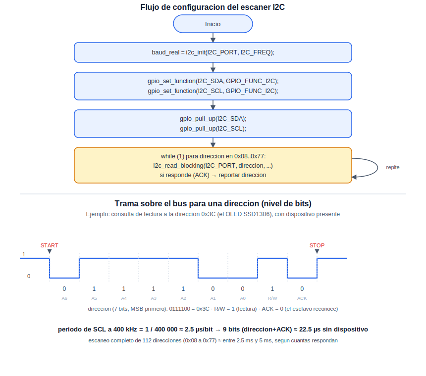
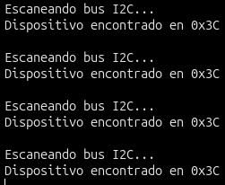

# I2C: Comunicación Síncrona de Bus

Tras cubrir la comunicación asíncrona por UART y la temporización de hardware, esta práctica introduce el bus I2C, un protocolo síncrono que permite conectar múltiples dispositivos esclavos sobre únicamente dos líneas compartidas (datos y reloj). Como dispositivo de prueba se emplea un display OLED SSD1306 con conector QWIIC, aprovechado únicamente para confirmar que responde en el bus; su control completo (inicialización del controlador y escritura de contenido) no forma parte de esta práctica y se abordará más adelante, en la sección de Aplicaciones e Integración.

## Concepto Teórico

El bus I2C es un protocolo síncrono maestro-esclavo que opera sobre dos líneas compartidas por todos los dispositivos conectados: datos (SDA) y reloj (SCL). Ambas líneas son de colector abierto (*open-drain*): ningún dispositivo impone activamente un nivel alto, sino que lo dejan flotar hacia arriba mediante resistencias de pull-up —de ahí que estas resistencias sean indispensables para el funcionamiento del bus—. Cada transacción inicia con una condición de START (SDA transita de alto a bajo mientras SCL permanece alto, una secuencia que no ocurre durante una transferencia de datos normal, y que por eso resulta inconfundible para todos los dispositivos), seguida de la dirección de 7 bits del esclavo con el que se desea comunicar y un bit adicional que indica si la operación es de lectura o escritura. El dispositivo direccionado, si está presente y disponible, reconoce la trama llevando SDA a nivel bajo durante un noveno pulso de reloj (ACK); en caso contrario, la línea permanece en alto (NACK) — precisamente la señal que un escaneo de bus aprovecha para determinar qué direcciones están ocupadas.
 
El siguiente diagrama resume la configuración empleada en el código, y muestra, a nivel de bits, cómo se ve sobre el bus la consulta a una única dirección durante el escaneo:

<div align="center">
  
</div>

**Cálculo de la duración del escaneo.** A 400 kHz (modo rápido), cada bit sobre el bus ocupa:
 
```
periodo_de_bit = 1 / 400 000 ≈ 2.5 µs
```
 
Cuando una dirección no tiene ningún dispositivo, la transacción se limita a la dirección y el bit R/W (7+1 bits) más el bit de ACK/NACK, es decir, 9 bits:
 
```
sin_dispositivo ≈ 9 × 2.5 µs ≈ 22.5 µs
```
 
Cuando sí hay un dispositivo presente, la transacción continúa con un byte de datos (8 bits) más su propio ACK, agregando 9 bits adicionales:
 
```
con_dispositivo ≈ 18 × 2.5 µs ≈ 45 µs
```
 
El escaneo completo recorre las direcciones de `0x08` a `0x77` —112 direcciones válidas, una vez excluidos los bloques reservados por el estándar I2C en ambos extremos—, de modo que una vuelta completa toma, aproximadamente, entre `112 × 22.5 µs ≈ 2.5 ms` (si ningún dispositivo respondiera) y `112 × 45 µs ≈ 5 ms` (si todas respondieran). En cualquier caso, el escaneo completo es varios órdenes de magnitud más rápido que la pausa de 5 segundos entre una vuelta y la siguiente.

## Hardware y Conexiones

| Elemento | Pin del RP2040 | Descripción |
|---|---|---|
| Display OLED SSD1306 (conector QWIIC) | — | Empleado únicamente como dispositivo esclavo de prueba para el escaneo |
| SDA (QWIIC) | GPIO0 (I2C0 SDA) | Línea de datos del bus |
| SCL (QWIIC) | GPIO1 (I2C0 SCL) | Línea de reloj del bus |
| 3V3 (QWIIC) | 3V3(OUT) | Alimentación del display |
| GND (QWIIC) | GND | Referencia de tierra común |

> **Nota:** el conector QWIIC agrupa estas cuatro señales en un solo cable JST-SH de 4 pines. Dado que la placa RP2040 empleada no cuenta con un conector QWIIC nativo, se utiliza un cable QWIIC-a-jumper para conectar cada señal a su pin correspondiente.

## Configuración del Proyecto (CMake)

```cmake
target_link_libraries(${PROJECT_NAME}
    pico_stdlib
    hardware_i2c
)
```

## Código Fuente

```c
/**
 * @file main.c
 * @brief Escaneo de direcciones en el bus I2C
 *
 * @author obviousfancy
 * @board  pico
 * @sdk    Raspberry Pi Pico SDK 2.2.0
 */

/* ─── Includes ─────────────────────────────────────────── */
#include <stdio.h>
#include "pico/stdlib.h"
#include "hardware/i2c.h"

/* ─── Defines ──────────────────────────────────────────── */
#define I2C_SDA  0
#define I2C_SCL  1
#define I2C_PORT i2c0
#define I2C_FREQ 400000

/* ─── Main ─────────────────────────────────────────────── */
int main() {
    stdio_init_all();

    uint baud_real = i2c_init(I2C_PORT, I2C_FREQ);

    // El periferico opera en modo maestro por defecto; no es necesario
    // llamar a i2c_set_slave_mode(), reservada para cuando el RP2040
    // deba responder como esclavo ante otro maestro (no es el caso aqui).

    gpio_set_function(I2C_SDA, GPIO_FUNC_I2C);
    gpio_set_function(I2C_SCL, GPIO_FUNC_I2C);
    gpio_pull_up(I2C_SDA);
    gpio_pull_up(I2C_SCL);

    printf("Frecuencia solicitada: %d Hz, frecuencia real: %u Hz\n", I2C_FREQ, baud_real);
    sleep_ms(2000);  // Margen para abrir la terminal antes del primer escaneo

    while (1) {
        printf("\nEscaneando bus I2C...\n");
        int dispositivos = 0;

        for (uint8_t addr = 0x08; addr < 0x78; addr++) {
            uint8_t rxdata;
            int resultado = i2c_read_blocking(I2C_PORT, addr, &rxdata, 1, false);

            if (resultado >= 0) {
                printf("Dispositivo encontrado en 0x%02X\n", addr);
                dispositivos++;
            }
        }

        if (dispositivos == 0) {
            printf("Ningun dispositivo respondio en el bus\n");
        }

        sleep_ms(5000);
    }
}
```

## Análisis del Código

`i2c_init(I2C_PORT, I2C_FREQ)` habilita el periférico y configura la frecuencia del bus; al igual que en UART, retorna la frecuencia real alcanzada, que puede diferir levemente de la solicitada por derivarse de un divisor entero sobre el reloj del sistema. El comentario que sigue documenta, de manera deliberada, una función disponible pero no utilizada (`i2c_set_slave_mode()`): dado que el modo maestro ya es el estado por defecto del periférico y es el que esta práctica requiere, no hay nada que configurar en ese sentido, pero vale la pena que quede señalado en lugar de omitirlo en silencio. `gpio_set_function()` sobre ambos pines conecta físicamente el bus al periférico I2C0; sin ella, los pines permanecerían en su función GPIO por defecto. `gpio_pull_up()` habilita las resistencias internas del RP2040 como respaldo, en caso de que el módulo QWIIC conectado no incluya las suyas propias.
 
Dentro del ciclo principal, cada `i2c_read_blocking()` intenta leer un byte de la dirección indicada: un valor de retorno negativo (`PICO_ERROR_GENERIC`) indica ausencia de ACK —ningún dispositivo respondió—, mientras que un valor no negativo indica que sí se completó la transacción. El escaneo recorre únicamente las direcciones válidas de 7 bits (`0x08` a `0x77`), excluyendo los bloques reservados por el estándar I2C descritos en el Concepto Teórico.

## Verificación

Ábrase una terminal serial sobre el puerto USB-CDC que expone la placa (por ejemplo, `/dev/ttyACM0` en Linux) a 115200 baudios:

```bash
minicom -b 115200 -D /dev/ttyACM0
```

Cada 5 segundos debe imprimirse un nuevo escaneo del bus; con el display OLED conectado, debe reportarse un dispositivo en la dirección `0x3C` (o `0x3D`, según el modelo específico del módulo).

<div align="center">
  
  <p><em>Salida esperada en la terminal serial</em></p>
</div>

## Errores Comunes y Variantes

| Síntoma | Causa típica |
|---|---|
| No se detecta ningún dispositivo en el escaneo | Conexión incorrecta de SDA/SCL, cable QWIIC dañado, o falta de alimentación al display |
| Se detectan direcciones inesperadas o inconsistentes | Ausencia de resistencias de pull-up (ni internas ni en el módulo), lo que produce lecturas erráticas |
| Error de compilación relacionado con `i2c_read_blocking` | Falta el include de `hardware/i2c.h`, o `hardware_i2c` no está enlazado en el CMakeLists |

**Variantes:**

- Detener el escaneo periódico y ejecutarlo una sola vez al inicio, encendiendo el LED de la práctica de Blink si se detecta la dirección esperada del display.
- Reducir `I2C_FREQ` a 100 000 (modo estándar) y comparar, con el cálculo del Concepto Teórico, cuánto se alarga la duración total del escaneo.
- Ampliar el escaneo para reportar, además de la dirección, el nombre del dispositivo esperado en cada dirección conocida (por ejemplo, mediante una tabla de direcciones comunes).
