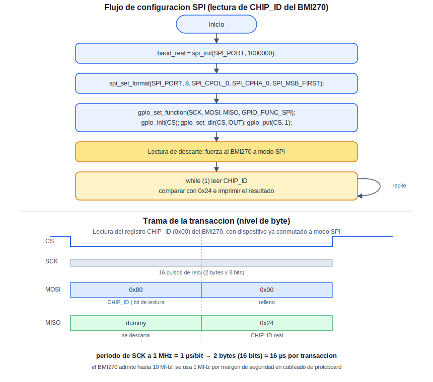

# SPI: Interfaz de Alta Velocidad

Esta práctica introduce el periférico SPI (*Serial Peripheral Interface*) del RP2040, un protocolo síncrono de alta velocidad. A diferencia de I2C, SPI no emplea direccionamiento sobre un bus compartido: cada dispositivo esclavo se selecciona mediante una línea dedicada de Chip Select (CS), y la comunicación es full-duplex —maestro y esclavo transmiten simultáneamente en cada ciclo de reloj, en lugar de turnarse—. Como dispositivo de prueba se emplea el sensor inercial BMI270 (IMU de 6 ejes), leyendo únicamente su registro de identificación (`CHIP_ID`) para confirmar que la comunicación es correcta, sin todavía implementar biblioteca alguna para el sensor.

## Concepto Teórico

SPI utiliza cuatro señales: reloj (SCK), generado siempre por el maestro; datos del maestro hacia el esclavo (MOSI); datos del esclavo hacia el maestro (MISO); y una línea de selección (CS) por cada esclavo conectado, que permanece en nivel bajo únicamente durante la transacción dirigida a ese dispositivo. A diferencia de I2C, el protocolo SPI en sí mismo no define un formato de trama fijo —no existe un bit de lectura/escritura estandarizado ni una dirección de 7 bits—: cada fabricante define, en la hoja de datos de su propio dispositivo, cómo interpretar los bytes intercambiados. En el caso del BMI270, el primer bit transmitido junto con la dirección del registro indica lectura o escritura (según su propia convención, no la del protocolo SPI en general).

Otra particularidad de este sensor: el primer byte que el BMI270 devuelve tras el byte de dirección es un byte de relleno (*dummy*) sin significado; el valor real del registro llega hasta el segundo byte recibido. Además, el BMI270 arranca configurado para I2C incluso si se planea usarlo por SPI —el propio fabricante indica que basta con realizar una primera lectura por SPI, descartando su resultado, para que el sensor conmute de manera permanente a la interfaz SPI durante esa sesión de energizado—.

El siguiente diagrama resume la configuración empleada en el código, y muestra la trama de bytes intercambiada al leer el registro `CHIP_ID`:

<div align="center">
  
</div>

**Cálculo del tiempo de transacción.** Con un reloj SPI de 1 MHz, cada bit ocupa:

```
periodo_de_bit = 1 / 1 000 000 = 1 µs
```

La transacción de lectura de un registro intercambia 2 bytes (16 bits) en total, de modo que:

```
tiempo_de_transaccion = 16 × 1 µs = 16 µs
```

El BMI270 admite hasta 10 MHz por SPI; se emplea 1 MHz de manera deliberadamente conservadora, para reducir el riesgo de errores de comunicación sobre cableado de protoboard.

## Hardware y Conexiones

| Señal (BMI270) | Pin del RP2040 | Descripción |
|---|---|---|
| SCK | GPIO18 (SPI0 SCK) | Reloj del bus, generado por el RP2040 como maestro |
| SDI (MOSI) | GPIO19 (SPI0 TX) | Datos del maestro hacia el esclavo |
| SDO (MISO) | GPIO16 (SPI0 RX) | Datos del esclavo hacia el maestro |
| CSB (CS) | GPIO17 | Selección de esclavo, activo en bajo, controlada por software |
| VDD / VDDIO | 3V3(OUT) | Alimentación del sensor |
| GND | GND | Referencia de tierra común |

## Configuración del Proyecto (CMake)

```cmake
target_link_libraries(${PROJECT_NAME}
    pico_stdlib
    hardware_spi
    hardware_gpio
)
```

## Código Fuente

```c
/**
 * @file Practice_SPI_10.c
 * @brief Verificacion de comunicacion SPI con el sensor BMI270 (lectura de CHIP_ID)
 *
 * @author obviousfancy
 * @board  pico
 * @sdk    Raspberry Pi Pico SDK 2.2.0
 */

/* ─── Includes ─────────────────────────────────────────── */
#include <stdio.h>
#include "pico/stdlib.h"
#include "hardware/spi.h"

/* ─── Defines ──────────────────────────────────────────── */
#define SPI_PORT   spi0
#define PIN_SCK    18
#define PIN_MOSI   19
#define PIN_MISO   16
#define PIN_CS     17

#define BMI270_CHIP_ID_REG    0x00
#define BMI270_CHIP_ID_VALUE  0x24

/* ─── Lectura de un registro del BMI270 por SPI ───────────
 * El BMI270 antepone un byte "dummy" a la respuesta real:
 * el primer byte recibido se descarta y el segundo corresponde
 * al valor efectivo del registro solicitado.
 */
static uint8_t bmi270_leer_registro(uint8_t reg) {
    uint8_t tx_buf[2] = { reg | 0x80, 0x00 };  // bit 7 en 1 indica lectura (convencion del BMI270)
    uint8_t rx_buf[2] = { 0 };

    gpio_put(PIN_CS, 0);
    spi_write_read_blocking(SPI_PORT, tx_buf, rx_buf, 2);
    gpio_put(PIN_CS, 1);

    return rx_buf[1];
}

/* ─── Main ─────────────────────────────────────────────── */
int main() {
    stdio_init_all();

    uint baud_real = spi_init(SPI_PORT, 1000 * 1000);  // 1 MHz

    // El periferico SPI opera en modo maestro por defecto tras spi_init();
    // no es necesario llamar a spi_set_slave(), reservada para cuando el
    // RP2040 deba operar como esclavo de otro maestro (no es el caso aqui).

    spi_set_format(SPI_PORT, 8, SPI_CPOL_0, SPI_CPHA_0, SPI_MSB_FIRST);

    gpio_set_function(PIN_SCK,  GPIO_FUNC_SPI);
    gpio_set_function(PIN_MOSI, GPIO_FUNC_SPI);
    gpio_set_function(PIN_MISO, GPIO_FUNC_SPI);

    gpio_init(PIN_CS);
    gpio_set_dir(PIN_CS, GPIO_OUT);
    gpio_put(PIN_CS, 1);  // CS inactivo en reposo (activo en bajo)

    printf("Frecuencia SPI solicitada: 1000000 Hz, real: %u Hz\n", baud_real);
    sleep_ms(10);

    // El BMI270 arranca configurado para I2C; una primera lectura por SPI
    // (cuyo resultado se descarta) es necesaria para forzar la seleccion
    // de la interfaz SPI, conforme al procedimiento de arranque del fabricante.
    bmi270_leer_registro(BMI270_CHIP_ID_REG);
    sleep_ms(1);

    while (1) {
        uint8_t chip_id = bmi270_leer_registro(BMI270_CHIP_ID_REG);

        if (chip_id == BMI270_CHIP_ID_VALUE) {
            printf("BMI270 detectado correctamente. CHIP_ID = 0x%02X\n", chip_id);
        } else {
            printf("BMI270 no responde como se esperaba. CHIP_ID leido = 0x%02X (esperado 0x%02X)\n",
                   chip_id, BMI270_CHIP_ID_VALUE);
        }

        sleep_ms(1000);
    }
}
```

## Análisis del Código

`spi_init(SPI_PORT, 1000000)` habilita el periférico y configura el reloj; como en UART e I2C, retorna la frecuencia real alcanzada. El comentario que sigue documenta una función disponible pero no utilizada (`spi_set_slave()`): dado que el modo maestro ya es el estado por defecto tras `spi_init()` y es el que esta práctica requiere, no hay nada que configurar en ese sentido, pero se deja señalado en lugar de omitirlo en silencio. `spi_set_format()` fija los cuatro parámetros indispensables para comunicarse correctamente con el BMI270: 8 bits por palabra, modo 0 (`SPI_CPOL_0`, `SPI_CPHA_0`) y bit más significativo primero. `gpio_set_function()` sobre SCK/MOSI/MISO los conecta al periférico SPI; el pin CS se maneja como un GPIO común, ya que el SDK del RP2040 no ofrece control automático de Chip Select.

`bmi270_leer_registro()` implementa, en crudo, el protocolo de lectura propio del BMI270: baja CS, intercambia 2 bytes mediante `spi_write_read_blocking()` (el byte de dirección con el bit de lectura, seguido de un byte de relleno para generar los pulsos de reloj adicionales necesarios para recibir la respuesta), sube CS, y descarta el primer byte recibido conforme a lo explicado en el Concepto Teórico. La primera llamada a esta función, antes del ciclo principal, existe únicamente para forzar la conmutación de interfaz del sensor; su resultado se ignora deliberadamente.

## Verificación

Ábrase una terminal serial sobre el puerto USB-CDC que expone la placa (por ejemplo, `/dev/ttyACM0` en Linux) a 115200 baudios:

```bash
minicom -b 115200 -D /dev/ttyACM0
```

Cada segundo debe imprimirse un mensaje confirmando la detección del BMI270 con `CHIP_ID = 0x24`.

<div align="center">
  
  <p><em>Salida esperada en la terminal serial</em></p>
</div>

## Errores Comunes y Variantes

| Síntoma | Causa típica |
|---|---|
| Se lee siempre `0x00` o `0xFF` | Cableado incorrecto (MISO/MOSI invertidos), falta de alimentación al sensor, o control incorrecto de CS |
| El `CHIP_ID` no coincide con `0x24` en la primera lectura, pero sí en las siguientes | Ausencia de la lectura inicial de descarte requerida para forzar la selección de interfaz SPI |
| Error de *linking* durante la compilación | Ausencia de `hardware_spi` en `target_link_libraries` |

**Variantes:**

- Reducir la velocidad del bus (por ejemplo, a 100 kHz) y observar el efecto sobre la fiabilidad de la lectura en cableado de protoboard de mala calidad.
- Intercambiar `SPI_CPOL_0`/`SPI_CPHA_0` por otra combinación de modo y confirmar que el `CHIP_ID` deja de leerse correctamente, para comprobar en la práctica la importancia de acertar el modo SPI.
- Comparar, sobre el mismo sensor, el número de líneas y la complejidad de inicialización requeridas por SPI frente a las empleadas en la práctica de I2C.
