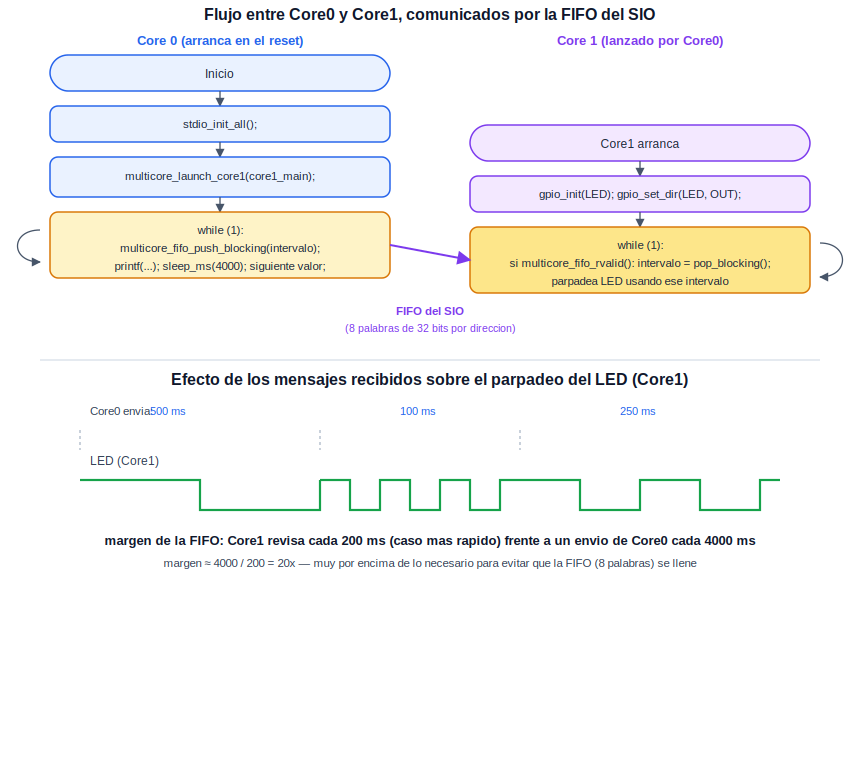

# Multicore: Procesamiento Dual

Esta práctica introduce el segundo núcleo del RP2040, empleado para ejecutar una tarea de manera independiente al núcleo principal —en este caso, parpadear el LED integrado a una velocidad indicada desde el otro núcleo—. Contar con dos núcleos permite dedicar uno a una tarea continua y sensible al tiempo (como controlar un actuador o muestrear un sensor a un ritmo constante) mientras el otro atiende lógica de más alto nivel, comunicación, o decisiones, sin que ninguno de los dos bloquee al otro.

## Concepto Teórico

Al energizarse, únicamente el Core0 comienza a ejecutar código; el Core1 permanece detenido hasta que el propio Core0 lo pone en marcha explícitamente mediante `multicore_launch_core1()`, indicándole la función que debe ejecutar. Ambos núcleos comparten el mismo espacio de memoria y los mismos periféricos —no existe una separación de RAM o de hardware entre ellos—, por lo que resulta indispensable contar con un mecanismo explícito para intercambiar datos entre ambos de manera ordenada, en lugar de que cada uno modifique variables compartidas sin coordinación.
 
Para ese propósito, el bloque SIO del RP2040 incluye dos FIFOs de hardware, una por cada sentido de comunicación, cada una con capacidad para 8 palabras de 32 bits. Estas FIFOs permiten que un núcleo deposite un valor (`multicore_fifo_push_blocking()`) y el otro lo retire en el mismo orden (`multicore_fifo_pop_blocking()`), sin necesidad de mecanismos de sincronización más complejos para este patrón simple de paso de mensajes. Las variantes *blocking* de estas funciones esperan lo que sea necesario —a que haya espacio libre para escribir, o a que haya un dato disponible para leer—; existen también variantes no bloqueantes (`multicore_fifo_rvalid()`, `multicore_fifo_wready()`) que permiten consultar el estado de la FIFO sin detener la ejecución, útiles cuando el núcleo no puede darse el lujo de esperar. El propio SIO puede además generar una interrupción cuando llega un dato nuevo a la FIFO, alternativa al sondeo cuando se prefiere un diseño enteramente dirigido por eventos; esta práctica utiliza sondeo por su sencillez.
 
El siguiente diagrama resume el flujo de ambos núcleos y el papel de la FIFO entre ellos, así como el efecto observable de los mensajes recibidos sobre el parpadeo del LED:

<div align="center">
  
</div>

**Margen de la FIFO.** Core0 envía un valor nuevo cada 4000 ms. En el caso más exigente de esta práctica (intervalo de 100 ms), Core1 revisa la FIFO una vez por cada ciclo completo de encendido y apagado del LED, es decir, cada 200 ms. Esto deja un margen de:

```
margen = 4000 ms / 200 ms = 20 veces
```

muy por encima de lo necesario para evitar que la FIFO —con capacidad para 8 valores pendientes— llegue a llenarse y detenga a Core0 en su siguiente intento de envío.

## Hardware y Conexiones

| Elemento | Pin del RP2040 | Descripción |
|---|---|---|
| LED integrado | GPIO25 | Mismo LED de la práctica de Blink; ahora controlado desde Core1 |

## Configuración del Proyecto (CMake)

```cmake
target_link_libraries(${PROJECT_NAME}
    pico_stdlib
    hardware_gpio
    pico_multicore
)
```

## Código Fuente

```c
/**
 * @file main.c
 * @brief Parpadeo del LED desde Core1, con el intervalo recibido desde Core0 por FIFO
 *
 * @author obviousfancy
 * @board  pico
 * @sdk    Raspberry Pi Pico SDK 2.2.0
 */

/* ─── Includes ─────────────────────────────────────────── */
#include <stdio.h>
#include "pico/stdlib.h"
#include "pico/multicore.h"

/* ─── Defines ──────────────────────────────────────────── */
#define LED_PIN 25

/* ─── Tarea de Core1 ───────────────────────────────────── */
void core1_main() {
    gpio_init(LED_PIN);
    gpio_set_dir(LED_PIN, GPIO_OUT);

    uint32_t intervalo_ms = 500;  // valor por defecto, mientras no llegue ninguno por FIFO

    while (1) {
        if (multicore_fifo_rvalid()) {
            intervalo_ms = multicore_fifo_pop_blocking();
        }

        gpio_put(LED_PIN, 1);
        sleep_ms(intervalo_ms);
        gpio_put(LED_PIN, 0);
        sleep_ms(intervalo_ms);
    }
}

/* ─── Main (Core0) ─────────────────────────────────────── */
int main() {
    stdio_init_all();

    multicore_launch_core1(core1_main);

    // Core1, una vez lanzado, permanece activo de forma indefinida; no es
    // necesario llamar a multicore_reset_core1(), reservada para reiniciar
    // o relanzar el nucleo con una funcion distinta (no es el caso aqui).

    uint32_t intervalos[] = {500, 100, 250};
    int idx = 0;

    while (1) {
        multicore_fifo_push_blocking(intervalos[idx]);
        printf("Core0: intervalo enviado = %lu ms\n", intervalos[idx]);

        idx = (idx + 1) % 3;
        sleep_ms(4000);
    }
}
```

## Análisis del Código

`multicore_launch_core1(core1_main)` inicializa la pila de Core1 y lo pone en marcha ejecutando `core1_main`; a partir de ese momento, ambos núcleos ejecutan código de manera simultánea e independiente. Dentro de `core1_main`, `multicore_fifo_rvalid()` consulta, sin bloquear, si hay un valor disponible en la FIFO; solo cuando lo hay se invoca `multicore_fifo_pop_blocking()` para retirarlo —de este modo, Core1 nunca se detiene esperando un mensaje que podría no llegar de inmediato, y continúa parpadeando el LED con el último intervalo conocido—. En Core0, la línea comentada documenta `multicore_fifo_wready()`, la contraparte de `rvalid()` para el lado que escribe; no es necesaria aquí porque el margen calculado en el Concepto Teórico (20 veces) hace prácticamente imposible que la FIFO llegue a llenarse. `multicore_fifo_push_blocking()` deposita un nuevo valor en la FIFO cada 4 segundos, alternando entre tres intervalos distintos, y `printf()` reporta cada envío sobre el puerto USB.

## Verificación

El LED integrado debe parpadear alternando su velocidad cada 4 segundos: lento (500 ms), luego rápido (100 ms), luego a un ritmo intermedio (250 ms), repitiendo este ciclo de manera continua. En la terminal serial debe observarse una línea `Core0: intervalo enviado = X ms` cada vez que ocurre un cambio.
 
Ábrase una terminal serial sobre el puerto USB-CDC que expone la placa (por ejemplo, `/dev/ttyACM0` en Linux) a 115200 baudios:

```bash
minicom -b 115200 -D /dev/ttyACM0
```

<div align="center">
  
  <p><em>Estado esperado del LED y de la terminal serial durante la práctica</em></p>
</div>

## Errores Comunes y Variantes

| Síntoma | Causa típica |
|---|---|
| El LED nunca cambia de velocidad | Core1 no revisa `multicore_fifo_rvalid()` dentro de su ciclo, o lo hace fuera del bucle principal |
| El programa se detiene por completo tras un tiempo | Se utilizó `multicore_fifo_pop_blocking()` directamente, sin verificar antes `multicore_fifo_rvalid()`, cuando aún no había llegado ningún dato |
| Error de *linking* durante la compilación | Ausencia de `pico_multicore` en `target_link_libraries` |

**Variantes:**

- Invertir el sentido de la comunicación: que Core1 cuente cuántas veces ha parpadeado el LED y reporte ese total a Core0 por la FIFO, para que Core0 lo imprima.
- Sustituir `multicore_fifo_push_blocking()` por `multicore_fifo_push_timeout_us()`, y manejar el caso en que Core1 no haya leído a tiempo el valor anterior.
- Usar el botón de la práctica de GPIO, leído desde Core0, para decidir qué intervalo enviar a Core1 en lugar de recorrer una lista fija.
