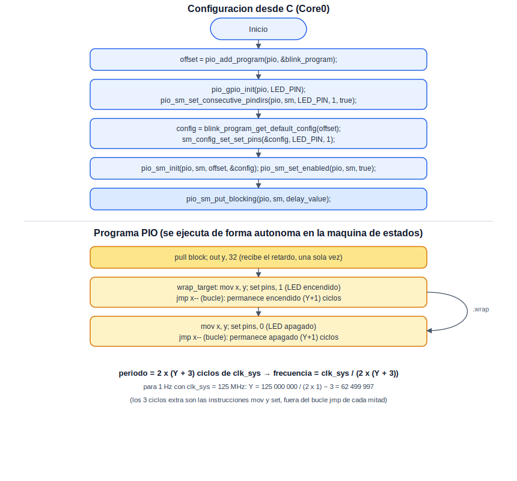
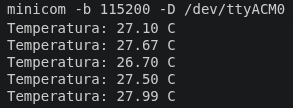

# PIO: Máquinas de Estado

Esta práctica cierra la sección introduciendo el Programmable I/O (PIO), la característica más distintiva del RP2040: un conjunto de pequeñas máquinas de estado programables mediante un juego de instrucciones propio, capaces de implementar periféricos completos en lo que equivale a "hardware definido por software", sin intervención continua de ningún núcleo de CPU. A modo de cierre, esta práctica recrea el parpadeo del LED de la práctica de Blink, pero delegando por completo el control del tiempo a una máquina de estados PIO, en lugar del propio procesador.

## Concepto Teórico

El RP2040 cuenta con dos bloques PIO, cada uno con cuatro máquinas de estado independientes y una memoria compartida de apenas 32 instrucciones. El juego de instrucciones es deliberadamente reducido —nueve instrucciones en total (`JMP`, `WAIT`, `IN`, `OUT`, `PUSH`, `PULL`, `MOV`, `IRQ`, `SET`)—, pero su combinación permite construir protocolos de comunicación completos o patrones de temporización precisos. Cada máquina de estados dispone de dos registros de trabajo (`X`, `Y`), y se comunica con el programa en C que se ejecuta en el procesador mediante dos FIFOs de hardware —una de entrada y otra de salida—, de manera similar a como Core0 y Core1 se comunicaban en la práctica de Multicore, aunque aquí uno de los dos extremos no es un núcleo de CPU, sino una máquina de estados dedicada.

El programa empleado en esta práctica recibe, una sola vez, un valor de retardo a través de la FIFO (mediante `pull`), lo conserva en el registro `Y`, y a partir de ahí enciende y apaga el pin del LED de manera indefinida, empleando `X` como contador regresivo para cada mitad del ciclo —recargándolo desde `Y` en cada vuelta, ya que `X` se agota durante el conteo—. A diferencia de `sleep_ms()`, empleado en Blink, aquí el retardo no depende de que el procesador esté disponible para atenderlo: la máquina de estados cuenta ciclos de manera autónoma, incluso si ambos núcleos están ocupados con otra tarea.

El siguiente diagrama muestra, por separado, la configuración que ocurre en C (una sola vez, al arrancar) y el programa PIO que corre de manera continua e independiente dentro de la máquina de estados:

<div align="center">
  
</div>

**Cálculo del valor de retardo.** Cada mitad del ciclo (LED encendido o apagado) consume `Y + 3` ciclos del reloj del sistema: uno para `mov x, y`, uno para `set pins`, y `Y + 1` para el bucle `jmp x--` (que se ejecuta una vez por cada valor de `X` desde `Y` hasta `0`, inclusive). Un ciclo completo (encendido + apagado) consume por tanto:

```
periodo_en_ciclos = 2 × (Y + 3)
frecuencia = clk_sys / periodo_en_ciclos = clk_sys / (2 × (Y + 3))
```

Despejando `Y` para obtener una frecuencia de parpadeo de 1 Hz —la misma cadencia empleada en Blink—, con el reloj de sistema típico de 125 MHz:

```
Y = clk_sys / (2 × frecuencia) − 3 = 125 000 000 / 2 − 3 = 62 499 997
```

Este es, precisamente, el valor que el código de esta práctica envía a la máquina de estados a través de la FIFO.

## Hardware y Conexiones

| Elemento | Pin del RP2040 | Descripción |
|---|---|---|
| LED integrado | GPIO25 | Mismo LED de la práctica de Blink; ahora controlado por una máquina de estados PIO |

## Configuración del Proyecto (CMake)

A diferencia de las prácticas anteriores, un programa PIO requiere un paso adicional en el CMakeLists —más allá de `target_link_libraries`— para que el ensamblador de PIO (`pioasm`) traduzca el archivo `.pio` a un encabezado de C durante la compilación:

```cmake
target_link_libraries(${PROJECT_NAME}
    pico_stdlib
    hardware_pio
)

pico_generate_pio_header(${PROJECT_NAME} ${CMAKE_CURRENT_LIST_DIR}/blink.pio)
```

## Código Fuente

Esta práctica se compone de dos archivos: el programa PIO (`blink.pio`) y el código en C que lo carga y lo pone en marcha.

`blink.pio`:

```
; blink.pio
; Enciende y apaga un pin durante un numero de ciclos recibido por la FIFO

.program blink

    pull block          ; Espera el valor de retardo enviado desde C
    out y, 32            ; Lo guarda en Y (se conserva durante toda la practica)

.wrap_target
    mov x, y             ; Recarga el contador regresivo desde Y
    set pins, 1          ; Enciende el LED
lp1:
    jmp x-- lp1          ; Permanece encendido durante (Y + 1) ciclos

    mov x, y             ; Recarga el contador regresivo desde Y
    set pins, 0          ; Apaga el LED
lp2:
    jmp x-- lp2          ; Permanece apagado durante (Y + 1) ciclos
.wrap                    ; Regresa al inicio del bucle, indefinidamente

% c-sdk {
static inline void blink_program_init(PIO pio, uint sm, uint offset, uint pin) {
    pio_gpio_init(pio, pin);
    pio_sm_set_consecutive_pindirs(pio, sm, pin, 1, true);

    pio_sm_config config = blink_program_get_default_config(offset);
    sm_config_set_set_pins(&config, pin, 1);

    // El divisor de reloj de la maquina de estados se deja en su valor por
    // defecto (1.0, velocidad maxima); esta practica regula la frecuencia
    // unicamente mediante el valor de retardo contado por software.

    pio_sm_init(pio, sm, offset, &config);
}
%}
```

`Practice_PIO_12.c`:

```c
/**
 * @file Practice_PIO_12.c
 * @brief Parpadeo del LED integrado mediante una maquina de estados PIO
 *
 * @author obviousfancy
 * @board  pico
 * @sdk    Raspberry Pi Pico SDK 2.2.0
 */

/* ─── Includes ─────────────────────────────────────────── */
#include "pico/stdlib.h"
#include "hardware/pio.h"
#include "hardware/clocks.h"
#include "blink.pio.h"

/* ─── Defines ──────────────────────────────────────────── */
#define LED_PIN 25

/* ─── Main ─────────────────────────────────────────────── */
int main() {
    PIO pio = pio0;
    uint sm = 0;
    uint offset = pio_add_program(pio, &blink_program);

    blink_program_init(pio, sm, offset, LED_PIN);
    pio_sm_set_enabled(pio, sm, true);

    // Valor de retardo para 1 Hz, con clk_sys = 125 MHz (ver Concepto Teorico)
    uint32_t delay_value = (clock_get_hz(clk_sys) / 2) - 3;
    pio_sm_put_blocking(pio, sm, delay_value);

    while (1) {
        // El nucleo queda libre: el parpadeo lo sostiene la maquina de
        // estados PIO de manera completamente autonoma.
        tight_loop_contents();
    }
}
```

## Análisis del Código

En `blink.pio`, `pull block` detiene la máquina de estados hasta que el programa en C deposite un valor en la FIFO; `out y, 32` lo transfiere al registro `Y`. Dentro de `.wrap_target`, cada mitad del ciclo recarga `X` desde `Y` (`mov x, y`), fija el nivel del LED (`set pins`), y consume `Y + 1` ciclos adicionales mediante el bucle `jmp x--`, tal como se detalló en el Concepto Teórico; `.wrap` regresa al inicio sin el costo de una instrucción `jmp` explícita. El bloque `c-sdk` embebido en el propio archivo `.pio` define `blink_program_init()`, una función auxiliar en C que prepara el pin (`pio_gpio_init`, `pio_sm_set_consecutive_pindirs`) y construye la configuración de la máquina de estados (`sm_config_set_set_pins`) antes de inicializarla; el comentario sobre el divisor de reloj documenta una opción disponible (`sm_config_set_clkdiv`) pero no utilizada, ya que esta práctica regula la frecuencia únicamente mediante el conteo por software.

En `Practice_PIO_12.c`, `pio_add_program()` carga el programa ensamblado en la memoria de instrucciones del bloque PIO y retorna el desplazamiento (*offset*) en el que quedó ubicado —necesario porque varios programas pueden convivir en la misma memoria compartida—. `blink_program_init()` y `pio_sm_set_enabled(pio, sm, true)` dejan la máquina de estados lista y en marcha. `pio_sm_put_blocking()` deposita en la FIFO el valor de retardo calculado a partir del reloj del sistema real (`clock_get_hz(clk_sys)`), en lugar de asumir 125 MHz de manera fija. El ciclo principal en C queda vacío: a diferencia de Blink, aquí el propio procesador no participa en absoluto en la temporización del parpadeo.

## Verificación

El LED integrado debe encender y apagar a intervalos de un segundo, exactamente como en la práctica de Blink —la diferencia no es visual, sino de diseño: aquí el parpadeo continúa de manera autónoma aunque el procesador esté ocupado con cualquier otra tarea, o incluso detenido.

<div align="center">
  
  <p><em>Estado esperado del LED integrado durante la práctica</em></p>
</div>

## Errores Comunes y Variantes

| Síntoma | Causa típica |
|---|---|
| El LED nunca enciende | Falta `pio_sm_put_blocking()`; la máquina de estados permanece detenida en `pull block` esperando el valor de retardo |
| Error de compilación relacionado con `blink.pio.h` | Falta `pico_generate_pio_header()` en el CMakeLists, o el archivo `.pio` no coincide con el nombre indicado ahí |
| El parpadeo ocurre a una velocidad inesperada | Cálculo incorrecto de `delay_value`, o uso de un valor fijo de `clk_sys` que no corresponde a la frecuencia real de la placa |

**Variantes:**

- Enviar un nuevo valor de retardo por la FIFO cada pocos segundos desde el ciclo principal en C, para variar la velocidad del parpadeo sin detener la máquina de estados.
- Cambiar `sm_config_set_clkdiv()` a un valor mayor que 1.0 y recalcular `delay_value` en consecuencia, para lograr la misma frecuencia con un valor de retardo mucho menor.
- Lanzar una segunda máquina de estados sobre otro pin, con un valor de retardo distinto, y observar cómo ambas parpadean de manera independiente sin coordinación adicional.
