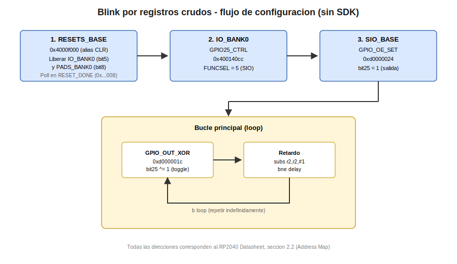

# Ensamblador: Blink por Registros Crudos

Esta practica implementa el parpadeo del LED integrado de la placa (GPIO25) escribiendo directamente sobre los registros de silicio del RP2040, sin invocar ninguna funcion del Pico SDK y sin utilizar la instruccion `BL` en ningun punto del codigo. Es la capa mas baja de la progresion pedagogica del curso: aqui se abre por completo la caja negra que, en las practicas posteriores, quedara oculta detras de funciones como `gpio_init` o `gpio_put`.

A diferencia del resto de la seccion "Ensamblador", esta practica es la unica excepcion explicita a la regla de no nombrar registros especificos del RP2040: el objetivo pedagogico central es precisamente que el docente vea el nombre, el offset y la direccion de cada registro involucrado.

## Concepto Teorico

Cuando el procesador Cortex-M0+ despierta, la mayoria de los bloques perifericos del RP2040 se encuentran retenidos en estado de reset. El bloque `RESETS` es el unico responsable de sacarlos de ese estado; hasta que esto ocurre, escribir en los registros de un periferico no tiene efecto garantizado. Por esta razon, antes de tocar cualquier registro de `IO_BANK0` es obligatorio liberar de su reset tanto a `IO_BANK0` como a `PADS_BANK0`.

El RP2040 ofrece, para casi todos sus registros de control, un conjunto de cuatro alias de escritura atomica mapeados en memoria a intervalos fijos de 0x1000 respecto a la direccion base del registro normal:

- Alias `+0x1000`: escritura tipo XOR (invierte los bits escritos)
- Alias `+0x2000`: escritura tipo SET (activa con OR los bits escritos)
- Alias `+0x3000`: escritura tipo CLR (desactiva con AND-NOT los bits escritos)

Esto permite modificar bits individuales de un registro sin necesidad de leerlo primero, modificarlo en un registro de CPU y volver a escribirlo completo (patron read-modify-write), lo cual evita condiciones de carrera cuando dos nucleos acceden al mismo registro.

Cada pin GPIO del RP2040 tiene una etapa de multiplexado de funcion (function select): el mismo pin fisico puede conectarse internamente a distintos perifericos (SPI, UART, I2C, PWM, PIO o al bloque `SIO`, que es el que permite manipular el pin como entrada/salida digital simple bajo control directo del procesador). Este multiplexado se configura en el bloque `IO_BANK0`, en el registro de control asociado a cada GPIO.

Una vez seleccionada la funcion `SIO` para un pin, el bloque `SIO` expone registros separados para: valor de salida (`GPIO_OUT`), habilitacion de salida (`GPIO_OE`) y valor de entrada (`GPIO_IN`). Habilitar la salida y despues alternar el bit correspondiente en `GPIO_OUT` (mediante su alias XOR) produce el parpadeo.

## Hardware y Conexiones

| Señal | Pin fisico | Notas |
|---|---|---|
| LED integrado | GPIO25 | LED soldado en la placa, no requiere conexion externa |

## Configuracion del Proyecto

Esta practica no enlaza el Pico SDK como capa de hardware (no se usa `pico_stdlib` ni `hardware_gpio`). Sin embargo, se conserva el arranque provisto por el SDK (`pico_runtime`), que es el responsable de la tabla de vectores, el bootloader de segunda etapa y la inicializacion basica de reloj antes de saltar a `main`. Escribir ese arranque a mano excede el alcance pedagogico del curso y no aporta a la comprension del periferico GPIO.

```cmake
add_executable(practica1_blink_raw main.s)
target_link_libraries(practica1_blink_raw pico_runtime)
pico_add_extra_outputs(practica1_blink_raw)
```

> **Nota especial:** al no enlazar `pico_stdlib`, esta practica no tiene disponible `printf` ni ninguna otra funcion de biblioteca C de alto nivel; toda observacion del comportamiento se hace unicamente mediante el LED fisico.

## Codigo Fuente

```asm
/**
 * @file main.s
 * @author obviousfancy
 * @board pico
 * @sdk Raspberry Pi Pico SDK 2.2.0
 */

.syntax unified
.cpu cortex-m0plus
.thumb

@ --- Direcciones de registro (RP2040 Datasheet, seccion 2.2 Address Map) ---
.equ RESETS_RESET_CLR,     0x4000f000  @ RESETS_BASE (0x4000c000) + alias CLR (offset 0x3000)
.equ RESETS_RESET_DONE,    0x4000c008  @ RESETS_BASE + offset 0x008
.equ IO_BANK0_GPIO25_CTRL, 0x400140cc  @ IO_BANK0_BASE (0x40014000) + 0x004 + 25*8
.equ SIO_GPIO_OE_SET,      0xd0000024  @ SIO_BASE (0xd0000000) + offset 0x024
.equ SIO_GPIO_OUT_XOR,     0xd000001c  @ SIO_BASE + offset 0x01c

.equ RESET_MASK_IO_PADS,   0x00000120  @ bit5 (IO_BANK0) | bit8 (PADS_BANK0)
.equ GPIO25_BIT,           0x02000000  @ 1 << 25
.equ FUNCSEL_SIO,          5           @ F5 = SIO, segun tabla de funciones GPIO del RP2040

.section .text
.global main
.thumb_func
main:
    @ 1. Sacar de reset a IO_BANK0 y PADS_BANK0 usando el alias CLR (atomico)
    ldr   r0, =RESETS_RESET_CLR
    ldr   r1, =RESET_MASK_IO_PADS
    str   r1, [r0]

wait_reset:
    @ Esperar hasta que RESET_DONE confirme que ambos bloques ya respondieron
    ldr   r0, =RESETS_RESET_DONE
    ldr   r1, [r0]
    ldr   r2, =RESET_MASK_IO_PADS
    ands  r1, r2            @ ARMv6-M: AND solo admite la forma de 2 operandos (Rdn, Rm)
    cmp   r1, r2
    bne   wait_reset

    @ 2. Seleccionar la funcion SIO en el registro de control de GPIO25
    ldr   r0, =IO_BANK0_GPIO25_CTRL
    movs  r1, #FUNCSEL_SIO
    str   r1, [r0]

    @ 3. Habilitar GPIO25 como salida, escribiendo en el alias SET de GPIO_OE
    ldr   r0, =SIO_GPIO_OE_SET
    ldr   r1, =GPIO25_BIT
    str   r1, [r0]

loop:
    @ 4. Alternar el estado del pin mediante el alias XOR de GPIO_OUT (operacion atomica)
    ldr   r0, =SIO_GPIO_OUT_XOR
    ldr   r1, =GPIO25_BIT
    str   r1, [r0]

    @ 5. Retardo por conteo de ciclos (aproximado, no calibrado a un tiempo exacto)
    ldr   r2, =500000
delay:
    subs  r2, r2, #1
    bne   delay

    b     loop

.end
```

## Analisis del Codigo

- **`RESETS_RESET_CLR` (alias atomico):** en lugar de leer `RESET`, aplicar una mascara AND-NOT en un registro de CPU y volver a escribir el registro completo, se escribe directamente en el alias CLR con los bits que se desean desactivar (poner en 0, es decir, sacar de reset). El hardware realiza la operacion de forma atomica.
- **`wait_reset`:** el bit correspondiente en `RESET_DONE` permanece en 0 mientras el periferico todavia esta completando su secuencia interna de reset. El bucle de espera evita escribir en `IO_BANK0` antes de que este listo para aceptar escrituras.
- **`ands r1, r2`:** el conjunto de instrucciones Thumb-1 del Cortex-M0+ (ARMv6-M) no incluye una forma de tres operandos para `AND` sobre registros; unicamente admite la forma `ANDS Rdn, Rm`, donde el registro destino y el primer operando son el mismo registro.
- **`IO_BANK0_GPIO25_CTRL`:** cada GPIO tiene un registro de estado y uno de control consecutivos (8 bytes por GPIO). El offset de `GPIO25_CTRL` se calcula como `0x004 + 25*8 = 0xcc`, sumado a la base de `IO_BANK0`.
- **`SIO_GPIO_OE_SET` / `SIO_GPIO_OUT_XOR`:** el bloque `SIO` es el unico camino de acceso a GPIO que no pasa por el bus APB, por lo que su lectura y escritura tiene latencia de un solo ciclo de reloj del procesador; de ahi que el SDK y este ejemplo lo usen para la manipulacion directa de pines.
- **Retardo por software:** al no usarse ningun periferico de temporizacion, el tiempo transcurrido depende exclusivamente del numero de ciclos que tarda el par `subs`/`bne` y de la frecuencia de reloj efectiva del procesador en el momento de la ejecucion; no debe interpretarse como una medida de tiempo precisa.

## Verificacion

Al cargar el programa mediante SWD (`pico-flash`), el LED integrado en GPIO25 debe parpadear de forma continua y perceptible a simple vista, sin salida por consola (esta practica no inicializa ningun mecanismo de `stdio`).

<div align="center"></div>

## Errores Comunes y Variantes

| Sintoma | Causa tipica |
|---|---|
| El LED permanece apagado y no responde | No se libero de reset `IO_BANK0`/`PADS_BANK0` antes de escribir en `IO_BANK0_GPIO25_CTRL` |
| El programa se queda detenido indefinidamente en `wait_reset` | Mascara de comparacion incorrecta, o se uso el registro `RESET` en lugar de `RESET_DONE` |
| El LED enciende pero nunca se apaga (o viceversa) | Se uso el alias `GPIO_OUT_SET` en el bucle en lugar de `GPIO_OUT_XOR`, fijando el bit en un solo estado |
| Error de ensamblado en la instruccion `ands` | Se escribio con sintaxis de tres operandos (`ands r1, r1, r2`), no soportada en ARMv6-M |

**Variantes propuestas:**

1. Modificar el codigo para controlar un segundo LED externo conectado a otro GPIO, replicando los mismos tres pasos de configuracion con la direccion de registro correspondiente a ese pin.
2. Calcular experimentalmente, mediante un cronometro y ajuste del valor de `r2`, el numero de iteraciones del bucle de retardo necesario para lograr un parpadeo de exactamente 1 Hz, y contrastarlo con el valor teorico usando la frecuencia de reloj por defecto del sistema.
3. Sustituir el uso del alias `GPIO_OUT_XOR` por una secuencia manual de lectura de `GPIO_OUT`, modificacion en un registro de CPU y escritura de vuelta (patron read-modify-write), y comparar el numero de instrucciones resultante frente a la version original.
