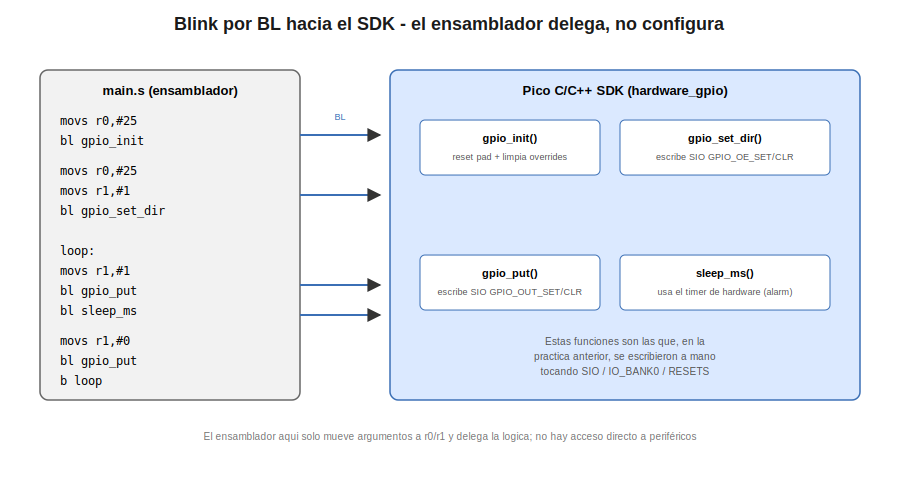

# Ensamblador: Blink por Llamadas BL al SDK

Esta practica retoma el parpadeo del LED integrado (GPIO25) de la practica anterior, pero reemplaza el acceso directo a los registros de silicio por llamadas mediante la instruccion `BL` a las funciones oficiales del Pico C/C++ SDK: `gpio_init`, `gpio_set_dir`, `gpio_put` y `sleep_ms`. El proposito es contrastar de forma directa ambos enfoques: el mismo resultado observable (un LED parpadeando), logrado en un caso escribiendo registros y en el otro delegando esa responsabilidad al SDK.

`gpio_set_dir` y `gpio_put` no se invocan de forma directa desde `main.s`, sino a traves de dos wrappers (`asm_gpio_set_dir`, `asm_gpio_put`) definidos en un archivo auxiliar, `sdk.c`, que acompana a esta practica. La razon se explica en el Concepto Teorico.

## Concepto Teorico

La instruccion `BL` (Branch with Link) realiza dos operaciones en un solo paso: guarda en el registro `LR` (Link Register) la direccion de la instruccion siguiente a la propia `BL`, y salta a la direccion indicada. Esto permite que la funcion invocada, al terminar, regrese al punto exacto desde el que fue llamada mediante la instruccion `BX LR`. Es el mecanismo fundamental que hace posible la subrutina en el conjunto de instrucciones ARM.

El paso de argumentos entre el codigo llamador y la funcion invocada sigue la convencion de llamada estandar de ARM (AAPCS - ARM Architecture Procedure Call Standard): los primeros cuatro argumentos enteros o punteros se colocan en los registros `r0`, `r1`, `r2` y `r3`, en ese orden. El valor de retorno, si lo hay, se recibe en `r0`. Ninguna de las funciones utilizadas en esta practica requiere mas de dos argumentos, por lo que basta con `r0` y `r1`.

Desde la perspectiva del ensamblador, cada una de estas funciones del SDK es una caja negra: el codigo que aqui se escribe no necesita conocer que registro de `SIO` o de `IO_BANK0` se modifica internamente. Esa es precisamente la logica que se implemento a mano en la practica anterior, y que ahora queda oculta detras de la interfaz en C del SDK. Esta es la esencia de la progresion pedagogica de tres capas del curso: cada capa abre la caja negra de la anterior, y esta practica representa el punto en el que esa caja se cierra de nuevo para dar paso a la capa central del curso (Pico C/C++ SDK).

`gpio_set_dir` y `gpio_put` estan declaradas como `static inline` en el header `hardware/gpio.h` del SDK. Una funcion inline no genera un simbolo de enlazado (linker symbol): el compilador de C inserta el codigo directamente en el sitio de la llamada, algo que un archivo de ensamblador puro (`.S`) no puede replicar, ya que solo puede saltar (`BL`) a una direccion con nombre. Por eso, invocarlas de forma directa desde `main.s` falla con `undefined reference`. La solucion es `sdk.c`, un archivo auxiliar en C que expone dos wrappers reales -- `asm_gpio_set_dir` y `asm_gpio_put` -- que unicamente invocan a las versiones inline del SDK; el compilador si puede expandirlas ahi porque se trata de un contexto de compilacion C. `gpio_init` y `sleep_ms` no requieren wrapper porque ya son funciones reales (no inline) del SDK.

## Hardware y Conexiones

| Señal | Pin fisico | Notas |
|---|---|---|
| LED integrado | GPIO25 | LED soldado en la placa, no requiere conexion externa |

## Configuracion del Proyecto

A diferencia de la practica anterior, aqui si se requiere enlazar la biblioteca estandar del SDK, ya que el codigo invoca directamente sus funciones de manejo de GPIO y de temporizacion.

```cmake
add_executable(main.S sdk.c)
target_link_libraries(pico_stdlib)
pico_add_extra_outputs(main.S)
```

`sdk.c` se agrega como fuente adicional junto a `main.s`: es el archivo que provee los wrappers `asm_gpio_set_dir` y `asm_gpio_put` que el ensamblador necesita para invocar las funciones inline del SDK.

## Codigo Fuente

```asm
/**
 * @file main.s
 * @author obviousfancy
 * @board pico
 * @sdk Raspberry Pi Pico SDK 2.2.0
 */

.syntax unified
.cpu cortex-m0plus
.thumb

.equ LED_PIN,    25
.equ GPIO_OUT,    1
.equ DELAY_MS,  500

.section .text
.global main
.thumb_func
main:
    @ gpio_init(LED_PIN)
    movs  r0, #LED_PIN
    bl    gpio_init

    @ asm_gpio_set_dir(LED_PIN, GPIO_OUT) -- wrapper de gpio_set_dir (inline)
    movs  r0, #LED_PIN
    movs  r1, #GPIO_OUT
    bl    asm_gpio_set_dir

loop:
    @ asm_gpio_put(LED_PIN, true) -- wrapper de gpio_put (inline)
    movs  r0, #LED_PIN
    movs  r1, #1
    bl    asm_gpio_put

    @ sleep_ms(DELAY_MS)
    ldr   r0, =DELAY_MS
    bl    sleep_ms

    @ asm_gpio_put(LED_PIN, false)
    movs  r0, #LED_PIN
    movs  r1, #0
    bl    asm_gpio_put

    @ sleep_ms(DELAY_MS)
    ldr   r0, =DELAY_MS
    bl    sleep_ms

    b     loop

.end
```

## Analisis del Codigo

- **`bl gpio_init`:** internamente saca de reset y configura el pad correspondiente, y selecciona la funcion `SIO` para el pin — el mismo trabajo realizado manualmente sobre `IO_BANK0` en la practica anterior, pero resuelto aqui en una sola llamada. Es una funcion real del SDK (no inline), por lo que se invoca directamente sin wrapper.
- **`movs r0, #LED_PIN` antes de cada llamada:** dado que ninguna de las funciones invocadas preserva necesariamente el valor previo de `r0`, el numero de pin se vuelve a cargar explicitamente antes de cada `bl`, en lugar de asumir que permanece intacto entre llamadas.
- **`bl asm_gpio_set_dir`:** wrapper definido en `sdk.c` que invoca a `gpio_set_dir` (inline en el SDK); equivale a la escritura sobre el alias `GPIO_OE_SET` del bloque `SIO` realizada en la practica anterior.
- **`bl asm_gpio_put`:** wrapper definido en `sdk.c` que invoca a `gpio_put` (inline en el SDK); equivale a la escritura sobre `GPIO_OUT_SET` o `GPIO_OUT_CLR` (segun el valor de `r1`) del bloque `SIO`.
- **`bl sleep_ms`:** a diferencia del retardo por conteo de ciclos de la practica anterior, esta funcion usa internamente el temporizador de hardware del RP2040, por lo que el tiempo de espera es preciso independientemente de la frecuencia de reloj del procesador. Al igual que `gpio_init`, es una funcion real del SDK y no requiere wrapper.
- **`ldr r0, =DELAY_MS`:** se utiliza `ldr` en lugar de `movs` porque el valor 500 excede el rango de 8 bits que admite la codificacion inmediata de `movs`; el ensamblador coloca el valor en el pool de literales y genera una carga indirecta.
- **`sdk.c`:** requerido porque `gpio_set_dir` y `gpio_put` son `static inline` en el SDK y no generan un simbolo de enlazado alcanzable desde ensamblador puro; expone `asm_gpio_set_dir` y `asm_gpio_put` como funciones reales que envuelven a las versiones inline.

## Verificacion

Al cargar el programa mediante SWD (`pico-flash`), el LED integrado en GPIO25 debe encender y apagar de forma alternada cada 500 ms, con una periodicidad estable gracias al uso del temporizador de hardware en `sleep_ms`.

<div align="center"></div>

## Errores Comunes y Variantes

| Sintoma | Causa tipica |
|---|---|
| Error de enlazado (`undefined reference to gpio_init`) | No se agrego `pico_stdlib` en `target_link_libraries` |
| Error de enlazado (`undefined reference to asm_gpio_set_dir` / `asm_gpio_put`) | No se agrego `sdk.c` como fuente del ejecutable en `add_executable` |
| El LED queda siempre encendido o siempre apagado | Se omitio recargar `r0`/`r1` antes de alguna llamada, o se invirtio el orden de los argumentos |
| El parpadeo es mas lento o mas rapido de lo esperado | Se modifico `DELAY_MS` sin considerar que el valor se expresa en milisegundos, no en ciclos |
| El programa no arranca en absoluto | Falta la etiqueta `.global main` o el atributo `.thumb_func`, necesario para que el enlazador marque la funcion como codigo Thumb |

**Variantes propuestas:**

1. Reemplazar `sleep_ms` por `sleep_us` y ajustar el valor del argumento para lograr un parpadeo perceptiblemente mas rapido, observando el limite practico de percepcion visual del ojo humano.
2. Agregar una segunda variable de pin y repetir la secuencia de `gpio_init`/`gpio_set_dir`/`gpio_put` para controlar un LED externo en un patron alternado (uno encendido mientras el otro esta apagado).
3. Sustituir las llamadas a `gpio_put` por una llamada equivalente a `gpio_xor_mask` (si esta disponible en la version del SDK utilizada) y comparar el numero de instrucciones generado frente a la version con `gpio_put`.
