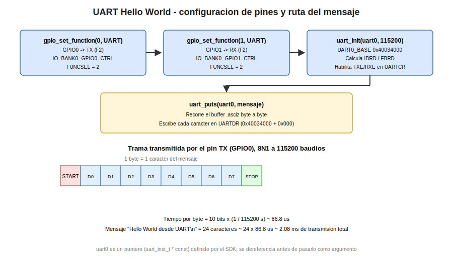

# Ensamblador: Hello World por UART

Esta practica cierra la seccion de Ensamblador con un ejemplo de comunicacion serial: el envio de un mensaje de texto fijo por UART0, verificable en una terminal serial conectada a traves del CH340 del UNIT DevLab MultiHub Shield. Al igual que la practica anterior, la logica de bajo nivel se delega mediante `BL` a las funciones oficiales del SDK (`gpio_set_function`, `uart_init`, `uart_puts`); el valor pedagogico de esta practica reside en la convencion de paso de argumentos y en el manejo de un puntero global definido por el SDK.

## Concepto Teorico

El envio de un mensaje de texto requiere, ademas de inicializar el periferico UART, resolver un detalle particular de la interfaz del SDK: la funcion `uart_init` no recibe un numero de UART (0 o 1) como argumento, sino un puntero a una estructura de tipo `uart_inst_t`. El SDK define dos variables globales, `uart0` y `uart1`, cada una declarada como un puntero constante (`uart_inst_t * const`) que apunta a la direccion base de los registros de hardware del periferico correspondiente.

Esto tiene una consecuencia directa sobre el codigo en ensamblador: la etiqueta `uart0` no es la direccion de los registros de UART0, sino la direccion de la variable que contiene esa direccion. Cargar en un registro de CPU el valor de `uart0` mediante una sola instruccion `ldr` entrega la direccion de la variable, no el puntero que se necesita pasar como argumento; es necesario un segundo `ldr` para leer el contenido de esa direccion y obtener asi el puntero real hacia la estructura de hardware.

En cuanto al mensaje en si, cada caracter se transmite como una trama serial independiente. Con la configuracion estandar de 8 bits de datos, sin paridad y 1 bit de parada (8N1), cada byte transmitido ocupa 10 bits en la linea: 1 bit de inicio, 8 bits de datos y 1 bit de parada. A 115200 baudios, el tiempo que ocupa cada byte en la linea es:

```
t_byte = 10 bits / 115200 baudios = 86.81 us
```

## Hardware y Conexiones

| Señal | Pin fisico | Notas |
|---|---|---|
| UART0 TX | GPIO0 | Conectado al pin RX del CH340 (UNIT DevLab MultiHub Shield) |
| UART0 RX | GPIO1 | Conectado al pin TX del CH340; no se utiliza en esta practica pero se configura por completitud |

## Configuracion del Proyecto

```cmake
add_executable(practica3_uart_hello main.s)
target_link_libraries(practica3_uart_hello pico_stdlib)
pico_add_extra_outputs(practica3_uart_hello)
```

## Codigo Fuente

```asm
/**
 * @file main.s
 * @author obviousfancy
 * @board pico
 * @sdk Raspberry Pi Pico SDK 2.2.0
 */

.syntax unified
.cpu cortex-m0plus
.thumb

.equ UART_TX_PIN,    0
.equ UART_RX_PIN,    1
.equ UART_BAUD,      115200
.equ GPIO_FUNC_UART, 2          @ F2 = UART, segun tabla de funciones GPIO del RP2040

.section .rodata
mensaje:
    .asciz "Hello World desde UART\n"

.section .text
.global main
.thumb_func
main:
    @ gpio_set_function(UART_TX_PIN, GPIO_FUNC_UART)
    movs  r0, #UART_TX_PIN
    movs  r1, #GPIO_FUNC_UART
    bl    gpio_set_function

    @ gpio_set_function(UART_RX_PIN, GPIO_FUNC_UART)
    movs  r0, #UART_RX_PIN
    movs  r1, #GPIO_FUNC_UART
    bl    gpio_set_function

    @ uart_init(uart0, UART_BAUD)
    ldr   r0, =uart0        @ direccion de la variable puntero uart0
    ldr   r0, [r0]          @ contenido de esa variable: el puntero real hacia el hardware
    ldr   r1, =UART_BAUD
    bl    uart_init

    @ uart_puts(uart0, mensaje)
    ldr   r0, =uart0
    ldr   r0, [r0]
    ldr   r1, =mensaje
    bl    uart_puts

fin:
    b     fin

.end
```

## Analisis del Codigo

- **`gpio_set_function(pin, GPIO_FUNC_UART)`:** equivale a escribir el campo `FUNCSEL` en el registro de control de `IO_BANK0` correspondiente a ese pin, tal como se hizo manualmente con `FUNCSEL_SIO` en la primera practica de esta seccion, pero aqui con el valor 2 (UART) en lugar de 5 (SIO).
- **`ldr r0, =uart0` seguido de `ldr r0, [r0]`:** el primer `ldr` obtiene la direccion donde el enlazador coloco la variable global `uart0`; el segundo `ldr` lee el valor almacenado en esa direccion, que es el puntero real hacia la estructura de hardware de UART0. Omitir el segundo `ldr` pasaria una direccion incorrecta a `uart_init` y `uart_puts`.
- **`bl uart_init`:** calcula internamente los divisores de baudrate (`IBRD` y `FBRD`) a partir de la frecuencia del reloj periferico y del valor solicitado, configura el formato de trama y habilita las lineas de transmision y recepcion del UART.
- **`mensaje` en `.section .rodata`:** al ser una cadena constante que no se modifica en tiempo de ejecucion, se ubica en la seccion de solo lectura en lugar de en una seccion de datos inicializados modificable.
- **`bl uart_puts`:** recorre internamente el buffer apuntado por `r1` hasta encontrar el caracter nulo que genera la directiva `.asciz`, transmitiendo cada byte por el registro de datos del UART.

## Verificacion

Con un monitor serial (`picocom` en Linux o `pico-monitor.py` en Windows) conectado al puerto correspondiente al CH340 del UNIT DevLab MultiHub Shield, configurado a 115200 baudios, debe observarse el texto `Hello World desde UART` seguido de un salto de linea, inmediatamente despues de reiniciar la placa.

<div align="center"></div>

## Errores Comunes y Variantes

| Sintoma | Causa tipica |
|---|---|
| No aparece ningun texto en la terminal | El monitor serial esta configurado a una velocidad de baudios distinta de 115200, o conectado al puerto incorrecto |
| El texto aparece con caracteres corruptos o ilegibles | Discrepancia en la velocidad de baudios entre el UART configurado y el monitor serial |
| Error de enlazado referente a `uart0` | Falta incluir la biblioteca `pico_stdlib` (o especificamente `hardware_uart`) en `target_link_libraries` |
| El programa se detiene o produce un HardFault al llamar `uart_init` | Se omitio el segundo `ldr` y se paso la direccion de la variable `uart0` en lugar de su contenido |

**Variantes propuestas:**

1. Modificar el mensaje de la seccion `.rodata` para incluir el nombre del docente o del grupo, y recompilar para verificar el cambio en la terminal serial.
2. Agregar una segunda llamada a `uart_puts` dentro de un bucle con retardo (reutilizando la logica de retardo de la primera practica o `sleep_ms` de la segunda), de forma que el mensaje se transmita repetidamente cada cierto intervalo.
3. Cambiar `UART_BAUD` a un valor distinto (por ejemplo 9600) y verificar, calculando el nuevo `t_byte`, cuanto tiempo adicional tomaria transmitir el mismo mensaje en comparacion con 115200 baudios.
