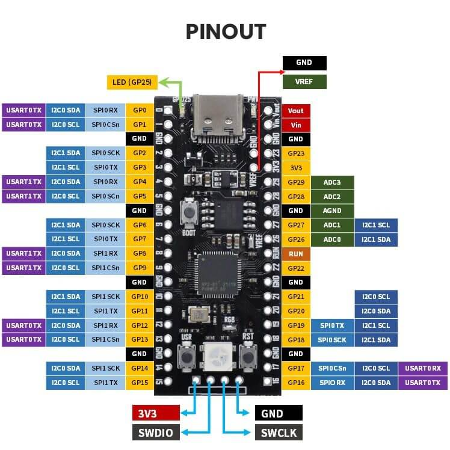
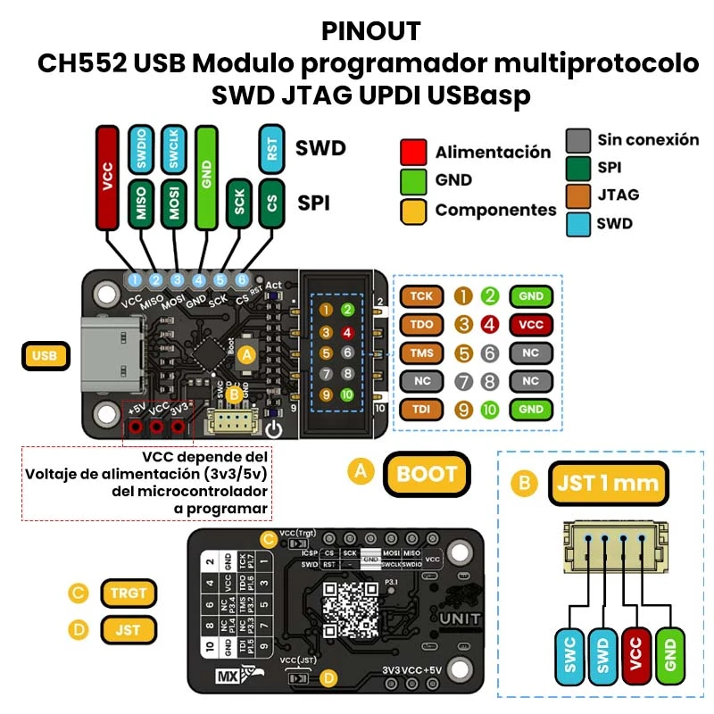

# Hardware: Microcontrolador, Pinout y Programador

Este documento describe el hardware sobre el que se ejecutan todos los ejemplos: el microcontrolador RP2040, la distribución de pines de la placa utilizada en el seminario, y el adaptador CH552 empleado para compilar, flashear y depurar los proyectos. Se recomienda revisar este documento antes de [Configuración del entorno](./devlab.md) y de los [ejemplos básicos](./ejemplos-basicos/README.md).

## El microcontrolador: RP2040

| Característica | Valor |
|---|---|
| Núcleos | 2× ARM Cortex-M0+ (dual-core) |
| Frecuencia | Hasta 133 MHz (200 MHz a 1.15V) |
| SRAM | 264 KB (en 6 bancos) |
| Memoria de programa | Externa, vía QSPI (flash NOR, típicamente 2 MB o más según la placa) |
| GPIO | 30 pines de propósito general (GP0–GP29) |
| ADC | 4 canales externos de 12 bits + 1 canal interno (sensor de temperatura) |
| Buses seriales | 2× UART, 2× I²C, 2× SPI |
| PIO | 2 bloques de Programmable I/O, 4 máquinas de estado cada uno |
| Referencia oficial | [RP2040 Datasheet](https://datasheets.raspberrypi.com/rp2040/rp2040-datasheet.pdf) |

A diferencia de otras familias de microcontroladores, el RP2040 no integra memoria flash en el mismo chip: el programa se ejecuta desde una memoria flash externa conectada por QSPI, cargada al iniciar mediante un bootloader en ROM. Esto es transparente para el desarrollo con el SDK, pero explica por qué el chip requiere una flash externa incluso en su presentación más mínima.

## Placa utilizada en el seminario

Las prácticas del Módulo II se desarrollan sobre una placa RP2040 con conector USB-C, distinta en factor de forma a la Raspberry Pi Pico oficial, aunque eléctricamente compatible: la asignación de buses por pin es la misma en ambas, por tratarse de una característica del propio chip y no de la placa.

### Pinout completo

<div align="center">
  
  <p><em>Development Board</em></p>
</div>

| GPIO | I²C | SPI | UART | ADC | Notas |
|---|---|---|---|---|---|
| GP0 | I2C0 SDA | SPI0 RX (MISO) | UART0 TX | — | |
| GP1 | I2C0 SCL | SPI0 CSn | UART0 RX | — | |
| GP2 | I2C1 SDA | SPI0 SCK | UART0 CTS | — | |
| GP3 | I2C1 SCL | SPI0 TX (MOSI) | UART0 RTS | — | |
| GP4 | I2C0 SDA | SPI0 RX (MISO) | UART1 TX | — | Usado en los ejemplos de I²C (SDA) |
| GP5 | I2C0 SCL | SPI0 CSn | UART1 RX | — | Usado en los ejemplos de I²C (SCL) |
| GP6 | I2C1 SDA | SPI0 SCK | UART1 CTS | — | |
| GP7 | I2C1 SCL | SPI0 TX (MOSI) | UART1 RTS | — | |
| GP8 | I2C0 SDA | SPI1 RX (MISO) | UART1 TX | — | |
| GP9 | I2C0 SCL | SPI1 CSn | UART1 RX | — | |
| GP10 | I2C1 SDA | SPI1 SCK | UART1 CTS | — | |
| GP11 | I2C1 SCL | SPI1 TX (MOSI) | UART1 RTS | — | |
| GP12 | I2C0 SDA | SPI1 RX (MISO) | UART0 TX | — | |
| GP13 | I2C0 SCL | SPI1 CSn | UART0 RX | — | |
| GP14 | I2C1 SDA | SPI1 SCK | UART0 CTS | — | Usado como entrada digital en el ejemplo de botón |
| GP15 | I2C1 SCL | SPI1 TX (MOSI) | UART0 RTS | — | |
| GP16 | I2C0 SDA | SPI0 RX (MISO) | UART0 TX | — | Usado en el ejemplo de SPI (MISO) |
| GP17 | I2C0 SCL | SPI0 CSn | UART0 RX | — | Usado en el ejemplo de SPI (CS) |
| GP18 | I2C1 SDA | SPI0 SCK | UART0 CTS | — | Usado en el ejemplo de SPI (SCK) |
| GP19 | I2C1 SCL | SPI0 TX (MOSI) | UART0 RTS | — | Usado en el ejemplo de SPI (MOSI) |
| GP20 | I2C0 SDA | SPI0 RX (MISO) | UART1 TX | — | |
| GP21 | I2C0 SCL | SPI0 CSn | UART1 RX | — | |
| GP22 | I2C1 SDA | SPI0 SCK | UART1 CTS | — | |
| GP23 | I2C1 SCL | SPI0 TX (MOSI) | UART1 RTS | — | Expuesto en esta placa; en la Pico oficial es de uso interno (control del regulador) |
| GP24 | I2C0 SDA | SPI1 RX (MISO) | UART0 TX | — | |
| GP25 | I2C0 SCL | SPI1 CSn | UART0 RX | — | **LED integrado de la placa** — evitar reasignarlo a un periférico |
| GP26 | I2C1 SDA | SPI1 SCK | UART0 CTS | ADC0 | |
| GP27 | I2C1 SCL | SPI1 TX (MOSI) | UART0 RTS | ADC1 | |
| GP28 | I2C0 SDA | SPI1 RX (MISO) | UART1 TX | ADC2 | |
| GP29 | I2C0 SCL | SPI1 CSn | UART1 RX | ADC3 | Usado en el ejemplo de temperatura como referencia de canal externo |

> Cada GPIO admite varias funciones alternas, pero solo una a la vez: `gpio_set_function()` selecciona cuál está activa. La tabla anterior lista las opciones disponibles, no funciones simultáneas.

### Pines y elementos adicionales de la placa

Fuera de los 30 GPIO de propósito general, la placa expone lo siguiente:

| Elemento | Descripción |
|---|---|
| `3V3` / `Vin` / `Vout` | Salida regulada de 3.3 V, entrada de alimentación externa, y salida de referencia respectivamente |
| `VREF` | Referencia de voltaje para el ADC, expuesta por separado para mediciones de mayor precisión |
| `GND` (múltiples) | Distribuidos entre los GPIO para minimizar la longitud de retorno de corriente |
| Botón `BOOT` | Fuerza el modo de arranque USB de almacenamiento masivo (BOOTSEL) al mantenerse presionado durante el reinicio |
| Botón `RST` | Reinicio del microcontrolador |
| Botón `USR` | Botón de propósito general, sin función reservada por el SDK |
| LED RGB direccionable | LED RGB Direccionable |
| LED `USR` | LED de proposito general, sin función reservada por el SDK en GP25 |
| Conector SWD (`3V3`, `SWDIO`, `GND`, `SWCLK`) | Puerto de depuración y programación de bajo nivel — ver sección siguiente |

## Programador y depurador: CH552

La compilación y carga de firmware descritas en [Configuración del entorno](./devlab.md) mediante el modo BOOTSEL y arrastre del archivo `.uf2` es funcional, pero en el flujo de trabajo del seminario se utiliza un adaptador basado en el chip CH552 que esta basado en CMSIS-DAP,que puede cumplir dos funciones simultáneas sobre una misma conexión USB:

1. **Depurador SWD compatible con CMSIS-DAP**, usado por OpenOCD o PyOCD para compilar y cargar el firmware directamente, sin requerir el modo BOOTSEL manual.
2. **Puente USB-serial (CDC-ACM)**, usado para observar la salida de `printf` cuando el proyecto no tiene habilitado el stdio nativo por USB.

::: info
En las practicas usaremos solo el **Depurador SWD compatible con CMSIS-DAP**, la función de puente USB serial, la delegaremos a la conexion usb integrada en nuestra tarjeta de desarrollo para poder evaluar la funcionalidad integrada de la misma.
:::
## Pinout

<div align="center">
  
  <p><em>Development Board</em></p>
</div>

### Conexión

El adaptador se conecta al conector SWD de 4 pines de la tarjeta de desarrollo:

| Adaptador CH552 JTAG| Adaptadpr CH552 SWD | Tarjeta RP2040 |
|---|---|---|
| 3V3 | 3V3 | 3V3 |
| TDO | SWDIO | SWDIO |
| GND | GND | GND |
| TDI(JTAG)| SWCLK | SWCLK |

### Flasheo mediante OpenOCD

```bash
openocd -f interface/cmsis-dap.cfg \
        -f target/rp2040.cfg \
        -c "adapter speed 5000" \
        -c "program build/${PROJECT_NAME}.elf verify reset exit"
```

### Descripción de los parámetros:

* **`-f interface/cmsis-dap.cfg`**: Carga el archivo de configuración (`-f`) de la interfaz de hardware. Le indica a OpenOCD que se va a comunicar utilizando una sonda de depuración que sigue el estándar **CMSIS-DAP**.
* **`-f target/rp2040.cfg`**: Carga el archivo de configuración del *target*. Esto le proporciona a OpenOCD toda la información sobre el mapa de memoria y los registros específicos del microcontrolador **RP2040**.
* **`-c "adapter speed 5000"`**: Pasa un comando de configuración en crudo (`-c`) para establecer la velocidad del reloj de depuración (SWD) en **5000 kHz (5 MHz)**, asegurando una conexión rápida y estable.
* **`-c "program ... verify reset exit"`**: Ejecuta una secuencia automatizada de comandos en un solo paso:
  * `program build/${PROJECT_NAME}.elf`: Escribe el binario ejecutable en la memoria flash del microcontrolador.
  * `verify`: Lee la memoria recién flasheada y la compara con el archivo original para asegurar que no hubo errores en la escritura.
  * `reset`: Envía una señal de reinicio al RP2040 para que arranque y empiece a ejecutar el nuevo firmware al instante.
  * `exit`: Cierra el servidor de OpenOCD automáticamente en cuanto termina la secuencia, liberando la terminal.
  
### Flasheo mediante PyOCD
```bash
pyocd flash \
    -t rp2040 \
    -f 5000000 \
    build/${PROJECT_NAME}.elf \
```

### Descripción de los parámetros:

* **`flash`**: Subcomando principal de pyOCD utilizado para borrar la memoria, escribir el nuevo binario y verificar que la carga se haya realizado correctamente.
* **`-t rp2040`**: Define el *target* o microcontrolador objetivo. Esto le indica a pyOCD cómo interactuar con el mapa de memoria específico del RP2040.
* **`-f 5000000`**: Configura la velocidad del reloj del adaptador de depuración (CMSIS-DAP) en Hz. `5000000` equivale a **5 MHz**, que ofrece un excelente balance entre velocidad de transferencia y estabilidad en las líneas de datos.
* **`build/${PROJECT_NAME}.elf`**: Especifica la ruta hacia el archivo ejecutable generado por el compilador. Al usar el formato `.elf`, se conserva la información necesaria si deseas realizar depuración en tiempo real más adelante.

Si `PICO_BOARD` está configurado como `pico2` o `pico2_w`, el archivo de destino cambia a `target/rp2350.cfg`, conforme a lo indicado en la [referencia de CMakeLists.txt](./CMakeLists.md).

### Errores comunes

| Síntoma | Causa probable |
|---|---|
| OpenOCD no detecta el adaptador | Cable o conexión SWD floja; verificar continuidad de las cuatro señales |
| En Windows, el dispositivo no es reconocido | Instalar el driver WinUSB para la interfaz CMSIS-DAP mediante [Zadig](https://zadig.akeo.ie/) |
| El flasheo se completa pero no se observa salida por consola | El puerto serie del CH552 es distinto al de la interfaz de depuración; verificar qué puerto COM/ttyACM corresponde a cada función |
| `program` falla con error de verificación | Placa no reiniciada correctamente tras un flasheo previo; desconectar y reconectar antes de reintentar |
